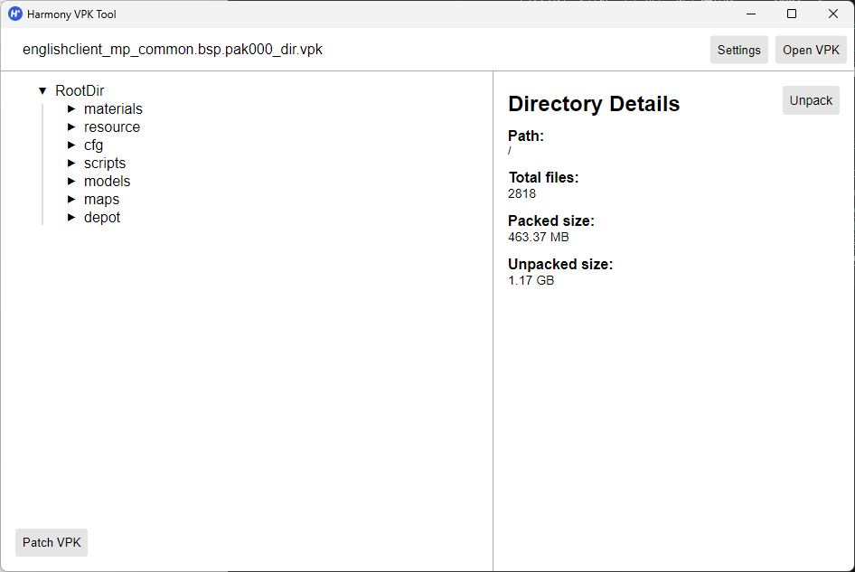
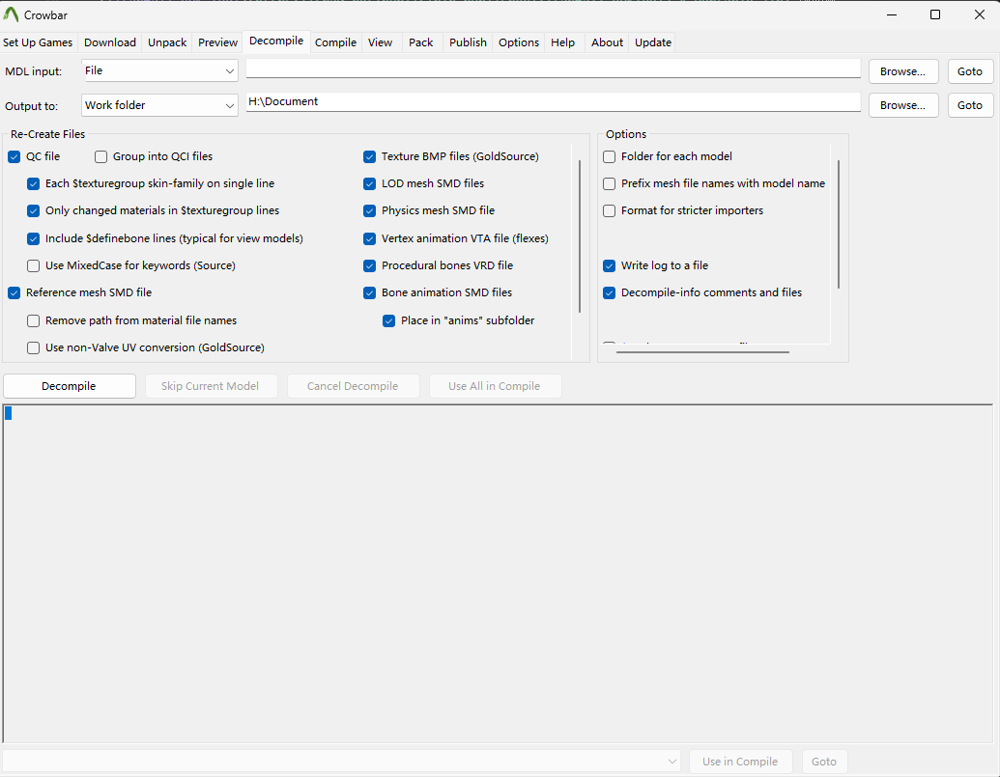
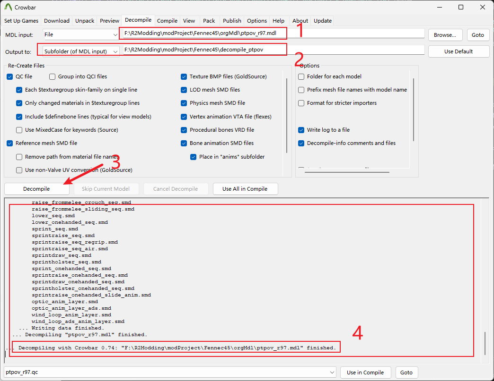

# 1. 获取游戏原本的武器贴图动画

<span style="color:rgb(131, 131, 131);">文档作者：HK560</span>

要制作武器mod，我们肯定是需要获取游戏原本的武器模型手臂模型还有贴图动画等资源文件。

考虑到可能部分制作者是第一次尝试制作mod；我推荐找一个地方新建一个`R2Modding`文件夹，用于存放我们之后用于制作mod的项目和相关文件。

我们可以新建一个文件夹`R2Modding/modProject/Fennec45`，用于存放我们本项目涉及的相关文件。


## 1.1 解包vpk文件

基本上，ttf2的模型文件存放在游戏目录下的vpk里，也就是`Titanfall2\vpk`下的vpk文件，这个vpk文件格式来自起源引擎，但又和其他常见的起源引擎游戏封装的vpk有些许不同，我们需要专门的工具来打开浏览。

这里推荐使用[Harmony VPK Tool](https://github.com/harmonytf/HarmonyVPKTool)来打开提取vpk文件

我喜欢把用到的工具都放在一个特定的文件夹下，所以我把`Harmony VPK Tool`工具放到了`R2Modding/toolWorkSpace`里面，方便以后使用。

打开`Harmony VPK Tool`，选择`Open VPK`，找到`Titanfall2\vpk`下的vpk文件。

因为我们需要的是武器模型手臂模型等资源基本都放在`englishclient_mp_common.bsp.pak000_dir.vpk`文件里，所以直接找到这个文件并打开。



左边显示的是文件列表，右边显示的是对应文件基本信息。我们点击左边的`RootDir`，再点击右边的`Unpack`按钮，选择一个位置导出。

我这边选择的是新建个文件夹`R2Modding/vpkUnpack/englishclient_mp_common.bsp.pak000_dir`，并导出到此文件夹下，点击确定导出。


最后的文件布局大概是如此
```
R2Modding/vpkUnpack
└── englishclient_mp_common.bsp.pak000_dir
   ├── cfg
   ├── depot
   ├── maps
   ├── materials
   ├── models
   ├── resource
   └── scripts
```

这样我们就得到`englishclient_mp_common.bsp.pak000_dir`里的所有内容了，之后我们会频繁的使用此文件夹里的内容。

## 1.2 获取武器模型MDL文件

我们的模型文件基本都在`englishclient_mp_common.bsp.pak000_dir\models`文件夹下，包括人物模型，武器模型等。我们需要的R97的模型文件在`englishclient_mp_common.bsp.pak000_dir\models\weapons\r97`文件夹下。

如果你需要其他找到武器模型的文件位置可以参考[NoSkill文档](https://noskill.gitbook.io/titanfall2/documentation/file-location)

此r97文件夹有如下两个文件
```
r97
├── ptpov_r97.mdl
└── w_r97.mdl
```
其中以`ptpov_`开头的文件是武器的第一人称下模型文件（你自己看到的），以`w_`开头的文件是第三人称下的武器世界模型文件（第三人称下你看到角色上拿的武器）。

我们把这两个文件复制到`R2Modding/modProject/Fennec45/orgMdl`文件夹下。

## 1.3 获取武器贴图文件

与模型文件存放的路径有所不同，游戏的贴图材质大部分存放在游戏目录下的`Titanfall2\r2\paks\Win64`文件夹里的`rpak`文件里。（`vpk`文件里也有存放材质和贴图，但比较少用于特殊情况）

`rpak`是重生自己封装的一种文件格式，需要特定的软件打开。

这里推荐使用[RSX](https://github.com/r-ex/rsx)来打开浏览`rpak`文件。

同样的我们把这个工具下载下来并丢到`R2Modding/toolWorkSpace/rsx`文件夹下。

打开`rsx.exe`，选择`Open File...`，找到`Titanfall2\r2\paks\Win64`文件夹，我们要找的武器贴图存放在`common.rpak`里，找到并打开。


RSX的使用没有看起来那么复杂，大家自己摸索一下就会了。

基本上就是左上角`Edit > Settings`里打开设置窗口配置一些导出的参数和格式。

`Asset List`则是你刚刚打开的rpak文件里的资产列表，可以在上面的窗口中搜索。

选中某一个资产就可以在`Asset Info`窗口中查看信息。

找到我们的r97武器材质，在`Asset List`窗口中搜索`r97`，会罗列出一堆资产。

有材质和贴图，我们可以直接找到材质点击导出，这样也会顺带导出此材质使用到的所有贴图。


然后我们就可以在`rsx.exe`所在目录下的`exported_files`文件夹下找到我们导出的贴图文件。
```
rsx
├── exported_files
|  ├── ...
|  └── texture
|     └── models
|        └── Weapons_R2
|           └── r97
|              ├── R97_CN_ao.png
|              ├── R97_CN_cav.png
|              ├── R97_CN_col.png
|              ├── R97_CN_gls.png
|              ├── R97_CN_ilm.png
|              ├── R97_CN_nml.png
|              └── R97_CN_spc.png
├── imgui.ini
└── rsx.exe
```


我们复制这些贴图文件到`R2Modding/modProject/Fennec45/orgTex`文件夹下之后备用。


## 1.4 提取第一人称武器MDL文件里的模型和动画

回到刚刚提取出来的武器MDL文件上。

如果你制作过L4D2等其他起源引擎游戏的MOD，那么你一定对MDL文件不陌生。但是当然泰坦陨落2的MDL文件和L4D2等其他的MDL文件还是有所不同。不过我们还是可以使用`Crowbar`来进行反编译得到模型和动画文件。

下载[Crowbar](https://github.com/ZeqMacaw/Crowbar)，并解压到`R2Modding/toolWorkSpace/Crowbar`文件夹下。

打开`Crowbar.exe`，并切换到`Decompile`选项卡。




参考上图进行设置

接下来我们就可以反编译MDL文件了。

因为是要提取第一人称下的模型和动画，所以我们需要选择`ptpov_r97.mdl`文件。



如上图，在`MDL input`中选择我们刚刚提取出来的`ptpov_r97.mdl`文件路径，在`Output to` 中填入想要decompile到的文件夹路径。我这里习惯根据不同mdl类型导出到项目文件夹下的不同文件夹里，因为是ptpov所以我选择导出到`Fennec45\decompile_ptpov`。

然后点击`Decompile`按钮，等待反编译完成。

我们转到刚刚反编译到的文件夹，可以看到我们提取出来的模型和动画文件。

```
Fennec45/decompile_ptpov
├── ptpov_r97 decompile-log.txt
├── ptpov_r97 decompile-MDL.txt
├── ptpov_r97 decompile-VTX.txt
├── ptpov_r97 decompile-VVD.txt
├── ptpov_r97.qc
├── ptpov_r97_anims
|  ├── ads_in_anim.smd
|  ├── ......
|  └── wind_loop_anim_layer.smd
├── v_acgs.smd
├── v_cro.smd
├── v_holo.smd
├── v_proscreen.smd
├── v_r97.smd
├── v_r97_magazine.smd
├── v_r97_sight_front.smd
├── v_r97_sight_on.smd
└── v_r97_sight_rear.smd
```

其中根目录下的`.smd`文件是模型文件了，`ptpov_r97_anims`文件夹下的是动画文件。

`ptpov_r97.qc`是核心的配置文件，其内容交代了如何组合模型和动画。具体请阅读文档[QC - Valve Developer Community](https://developer.valvesoftware.com/wiki/QC)

推荐安装[VSCode](https://code.visualstudio.com/),并安装扩展[	
Valve KeyValue Files Support](https://marketplace.visualstudio.com/items?itemName=GEEKiDoS.vdf)来打开编辑qc文件

接下来简单讲解一下qc文件的结构

```qc
$modelname "weapons/r97/ptpov_r97.mdl" // 编译出来之后的模型文件路径

```

```qc

....

$bodygroup "ptpov_r97"
{
	studio "v_r97.smd"  //武器本体模型文件
}
$bodygroup "proscreen"
{
	blank
	studio "v_proscreen.smd"  //击杀计数器模型文件
}
$bodygroup "sight_holo"
{
	blank
	studio "v_holo.smd"  //全息瞄准镜模型文件
}
$bodygroup "sight_acgs"
{
	blank
	studio "v_acgs.smd"  //ACGS瞄准镜模型文件
}
$bodygroup "sight_cro"
{
	blank
	studio "v_cro.smd"  //CRO瞄准镜模型文件
}

....

```
`$bodygroup`中配置的是模型文件，不同的分类可以用于不同的作用，例如`$bodygroup "proscreen"`中存在两行，第一行是`blank`，第二行是`studio "v_proscreen.smd"`，第一行表示此bodygroup不使用任何模型文件，第二行表示使用`v_proscreen.smd`模型文件。此时它对应了游戏里选择装备击杀计数器/或不装备时候，应该显示的模型是怎么样的。因为第一行是`blank`，代表空，所以不会显示任何模型，第二行是`studio`，表示使用模型文件，所以会显示`v_proscreen.smd`模型文件。其他bodygroup也是类似的

```qc
$texturegroup "skinfamilies"
{
	{ "models\Weapons_R2\r97\R97_CN"          }
	{ "models\Weapons_R2\r97\R97_CN_skin_31"  }
	{ "models\Weapons_R2\r97\R97_CN_prime_01" }
	{ "models\Weapons_R2\r97\R97_CN_prime_02" }
	{ "models\Weapons_R2\r97\R97_CN_prime_03" }
	{ "models\Weapons_R2\r97\R97_CN_prime_04" }
	{ "models\Weapons_R2\r97\R97_CN_prime_05" }
	{ "models\Weapons_R2\r97\R97_CN_prime_06" }
}
```
`$texturegroup`中配置的是材质路径组，不同的组对应不同的皮肤材质路径，这些材质路径对应了游戏里选择不同皮肤时候，应该的材质路径是什么。

```qc
$attachment "CAMERA_BASE" "jx_c_pov" 0 0 0 rotate -90 -90 0
$attachment "CAMERA" "jx_c_camera" 0 0 0 rotate -90 -90 0
$attachment "L_HAND" "ja_l_propHand" 0 0 0 rotate -90 -90 0
$attachment "R_HAND" "ja_r_propHand" 0 0 0 rotate -90 -90 0
....
```
`$attachment`中配置的是模型附件，例如`CAMERA_BASE`表示武器的相机基座附加在骨骼`jx_c_pov`上，后面跟着是一些偏移量旋转角度等。
```qc
$definebone "jx_c_delta" "" 0 0 0 0 0 0 0 0 0 0 0 0
$definebone "jx_c_pov" "jx_c_delta" 0 62.992001 0 0 0 0 0 0 0 0 0 0
$definebone "jx_c_camera" "jx_c_pov" 0 0 0 0 0 0 0 0 0 0 0 0
$definebone "def_c_hip" "jx_c_delta" 0 39.369999 0 0 0 0 0 0 0 0 0 0
$definebone "jx_c_start" "jx_c_delta" 0 0 0 0 0 0 0 0 0 0 0 0
```
`$definebone`中定义的是模型骨骼和骨骼之间的关系。

```qc
$animation "ads_in_anim" "ptpov_r97_anims\ads_in_anim.smd" {
	fps 30
}

$animation "ads_out_anim" "ptpov_r97_anims\ads_out_anim.smd" {
	fps 30
}
......
```
`$animation`中配置的是动画文件，例如`ads_in_anim`表示武器的瞄准动画，`ads_out_anim`表示武器的瞄准动画。

```qc
$sequence "ref" {
	"ptpov_r97_anims\ref.smd"
	fadein 0.2
	fadeout 0.2
	fps 30
}

$sequence "walk_seq" {
	"walk_anim_static"
	"walk_anim"
	"walk_anim_static"
	"walk_ads_anim"
	blend "velocity" 0 173
	blend "ads_blend" 0 1
	delta
	fadein 0.2
	fadeout 0.2
	realtime
	fps 30
	loop
}

$sequence "walk_seq_nocam" {
	"walk_anim_static"
	"walk_anim_nocam"
	"walk_anim_static"
	"walk_ads_anim"
	blend "velocity" 0 173
	blend "ads_blend" 0 1
	delta
	fadein 0.2
	fadeout 0.2
	realtime
	fps 30
	loop
}

......
```
`$sequence`中配置的是动画序列，和一些配置信息。


其他一些配置参数和变量不再过多详细介绍，一些参数会在后面着重介绍。具体的信息可以访问[Valve Developer Community](https://developer.valvesoftware.com/wiki/Category:QC_commands)查看。


## 1.5 在blender中组合模型和动画

基本上模型和动画我们都有了，可以开始尝试在Blender组合出武器模型并使用动画了

为此我们需要安装使用[Blender](https://store.steampowered.com/app/365670/Blender/), 我推荐使用Steam上安装的Blender，因为我们可能会频繁地切换版本，这在Steam上会比较方便。

因为受限于不同插件依赖的Blender版本，本教程主要使用**Blender 4.2LTS**版本

同时我们还需要下载安装[Blender Source Tools](http://steamreview.org/BlenderSourceTools/)插件，用于打开读取多个起源引擎的文件格式，其中就包括`.qc .smd`等格式

具体如何安装Blender和插件这里不再赘述，请自行网上搜索文档和教程。


todo....


