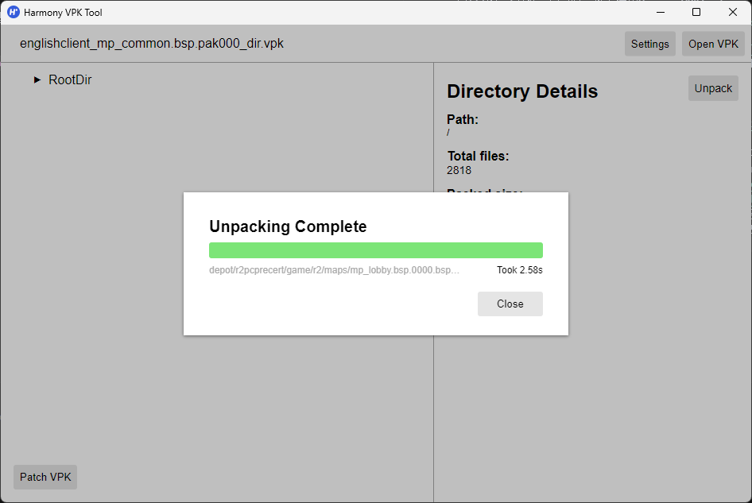
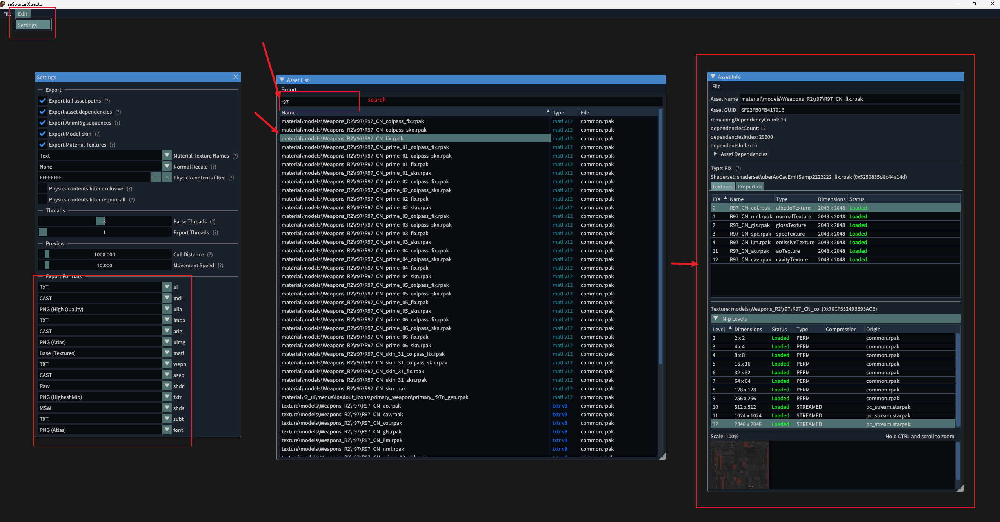
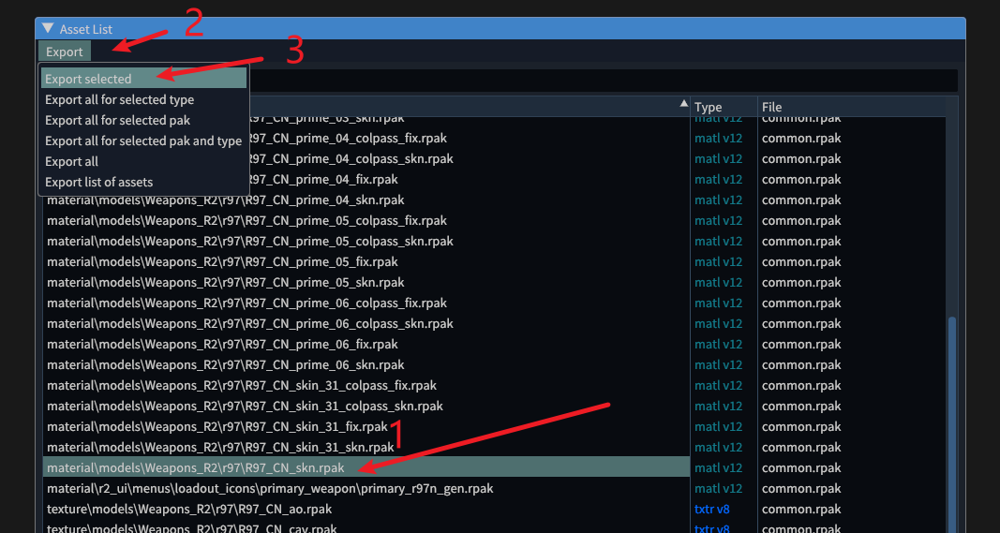
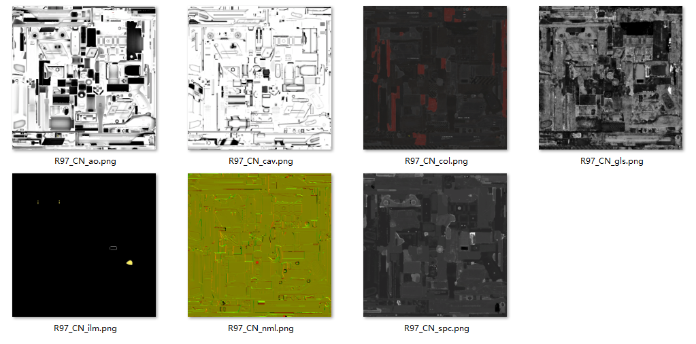

# 1. 获取游戏原本的武器贴图动画

<span style="color:rgb(131, 131, 131);">文档作者：HK560</span>

要制作武器mod，我们肯定是需要获取游戏原本的武器模型手臂模型还有贴图动画等资源文件。

考虑到可能部分制作者是第一次尝试制作mod；我推荐找一个地方新建一个`R2Modding`文件夹，用于存放我们之后用于制作mod的项目和相关文件。

我们可以新建一个文件夹`R2Modding/modProject/Fennec45`，用于存放我们本项目涉及的相关文件。


## 1.1 解包vpk文件

基本上，ttf2的模型文件存放在游戏目录下的vpk里，也就是`Titanfall2\vpk`下的vpk文件，这个vpk文件格式来自起源引擎，但又和其他常见的起源引擎游戏封装的vpk有些许不同，我们需要专门的工具来打开浏览。

这里推荐使用[Harmony VPK Tool](https://github.com/harmonytf/HarmonyVPKTool)来打开提取vpk文件

我喜欢把用到的工具都放在一个特定的文件夹下，所以我把`Harmony VPK Tool`工具放到了`R2Modding/toolWorkSpace`里面，方便以后使用。

打开`Harmony VPK Tool`，选择`Open VPK`，找到`Titanfall2\vpk`下的vpk文件。

因为我们需要的是武器模型手臂模型等资源基本都放在`englishclient_mp_common.bsp.pak000_dir.vpk`文件里，所以直接找到这个文件并打开。


左边显示的是文件列表，右边显示的是对应文件基本信息。我们点击左边的`RootDir`，再点击右边的`Unpack`按钮，选择一个位置导出。

我这边选择的是新建个文件夹`R2Modding/vpkUnpack/englishclient_mp_common.bsp.pak000_dir`，并导出到此文件夹下，点击确定导出。



最后的文件布局大概是如此
```
R2Modding/vpkUnpack
└── englishclient_mp_common.bsp.pak000_dir
   ├── cfg
   ├── depot
   ├── maps
   ├── materials
   ├── models
   ├── resource
   └── scripts
```

这样我们就得到`englishclient_mp_common.bsp.pak000_dir`里的所有内容了，之后我们会频繁的使用此文件夹里的内容。

## 1.2 获取武器模型MDL文件

我们的模型文件基本都在`englishclient_mp_common.bsp.pak000_dir\models`文件夹下，包括人物模型，武器模型等。我们需要的R97的模型文件在`englishclient_mp_common.bsp.pak000_dir\models\weapons\r97`文件夹下。

如果你需要其他找到武器模型的文件位置可以参考[NoSkill文档](https://noskill.gitbook.io/titanfall2/documentation/file-location)

此r97文件夹有如下两个文件
```
r97
├── ptpov_r97.mdl
└── w_r97.mdl
```
其中以`ptpov_`开头的文件是武器的第一人称下模型文件（你自己看到的），以`w_`开头的文件是第三人称下的武器世界模型文件（第三人称下你看到角色上拿的武器）。

我们把这两个文件复制到`R2Modding/modProject/Fennec45/orgMdl`文件夹下。

## 1.3 获取武器贴图文件

与模型文件存放的路径有所不同，游戏的贴图材质大部分存放在游戏目录下的`Titanfall2\r2\paks\Win64`文件夹里的`rpak`文件里。（`vpk`文件里也有存放材质和贴图，但比较少用于特殊情况）

`rpak`是重生自己封装的一种文件格式，需要特定的软件打开。

这里推荐使用[RSX](https://github.com/r-ex/rsx)来打开浏览`rpak`文件。

同样的我们把这个工具下载下来并丢到`R2Modding/toolWorkSpace/rsx`文件夹下。

打开`rsx.exe`，选择`Open File...`，找到`Titanfall2\r2\paks\Win64`文件夹，我们要找的武器贴图存放在`common.rpak`里，找到并打开。



RSX的使用没有看起来那么复杂，大家自己摸索一下就会了。

基本上就是左上角`Edit > Settings`里打开设置窗口配置一些导出的参数和格式。

`Asset List`则是你刚刚打开的rpak文件里的资产列表，可以在上面的窗口中搜索。

选中某一个资产就可以在`Asset Info`窗口中查看信息。

找到我们的r97武器材质，在`Asset List`窗口中搜索`r97`，会罗列出一堆资产。

有材质和贴图，我们可以直接找到材质点击导出，这样也会顺带导出此材质使用到的所有贴图。



然后我们就可以在`rsx.exe`所在目录下的`exported_files`文件夹下找到我们导出的贴图文件。
```
rsx
├── exported_files
|  ├── ...
|  └── texture
|     └── models
|        └── Weapons_R2
|           └── r97
|              ├── R97_CN_ao.png
|              ├── R97_CN_cav.png
|              ├── R97_CN_col.png
|              ├── R97_CN_gls.png
|              ├── R97_CN_ilm.png
|              ├── R97_CN_nml.png
|              └── R97_CN_spc.png
├── imgui.ini
└── rsx.exe
```



我们复制这些贴图文件到`R2Modding/modProject/Fennec45/orgTex`文件夹下之后备用。


## 1.4 提取MDL文件里的模型和动画


## 1.5 在blender中组合模型和动画


todo....


