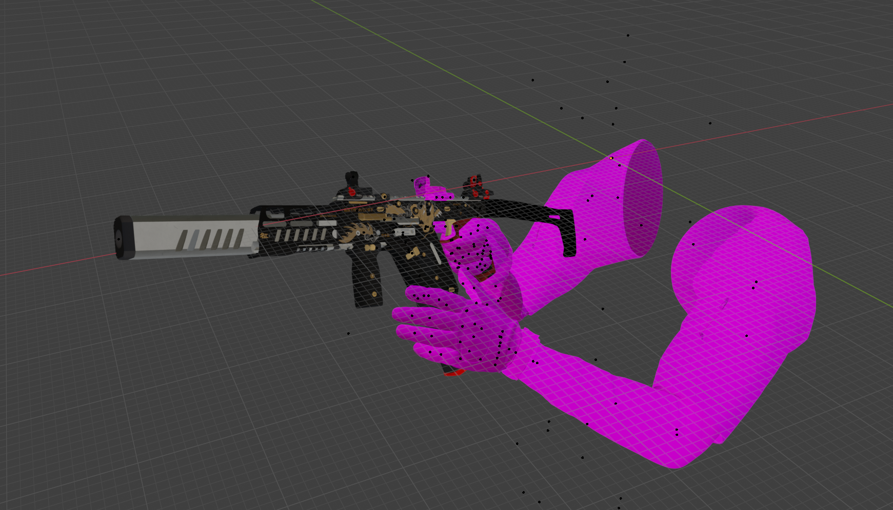

# 2. 获取自定义的武器模型动画

在上一章中，我们完成了游戏原本的武器模型动画导入到blender中。在这节我们也需要将我们自定义的武器模型和动画制作成blender项目。

但实际上本部分内容并没有什么太多值得说的，因为每个人自己的自定义模型动画来源都是不明确的，只要准备好了自定义的武器模型动画贴图即可。

例如本教程中是自定义武器模型是MW2022的Fennce45，我已经将其在Blender中组合完毕。

## 2.1 处理模型

在此阶段你可以对模型骨骼进行一些处理，具体根据你自己的需求。例如精简删除一些不必要的网格，或者删除一些不必要的骨骼。

除了上面这些，其实也还有一些预处理工作。

还记得我们上一章反编译出来的r97的武器模型吗，我们查看其qc文件，发现它定义了多个`$bodygroup`，这些`$bodygroup`组成了武器的模型，瞄准镜等。

也就是说我们为了实现瞄准镜切换，我们需要将fennec45的模型也拆分成多个`$bodygroup`

其实主要是分为：武器本体、各种瞄准镜、击杀计数器、弹匣，具体查看QC文件，不同的武器可能有所不同。

因此我们在blender中也可以先提前将我们的自定义武器模型分离出来这些模型，方便之后进行操作。

最好像我这样分类好，放入一个分组中，这样方便我们后面在不同项目中复制网格和骨架。

将此blender工程文件保存好，并另存一份备份，防止以后我们进行操作时出现问题。

在这里我将此blender工程文件名命名为`mwWeaponWithArm.blend`，保存到`Fennec45\blenderProject`文件夹下。

