# 3. 处理武器骨架
 
在开始接下来的步骤前，我们应该要充分理解我们接下来进行的操作的目的是什么。

我们需要把自定义武器（也就是本教程里的fennec45）的武器模型和动画都移植到TTF2中原本的武器（也就是本教程的r97）中。

如果只是替换武器模型不改动画的话很简单，不需要处理原本r97的骨架，直接替换模型就好了。

但是涉及到要移植动画那就麻烦很多了，因为fennec45的动画是基于fennec45的骨架的，而r97的骨架是基于r97的模型，所以需要将fennec45的骨架移植到r97的骨架中。但这不代表我们完全不需要r97的骨架，因为如果没有r97的骨架，游戏原本的很多动画是无法使用的。

两者骨架的区别在于含有不同的骨骼名称位置数量。

我们最好的办法应当是以r97的骨架为基础，把fennec45的骨架里的部分骨骼合并到r97骨架中。

例如fennec45骨架里的所有武器骨骼，这些是fennec45里独有的骨骼，我们需要这些骨骼来完成武器动画正常工作。

至于手臂骨骼呢，fennec45和r97的骨架里都有手臂骨骼，他们分别来自cod和ttf2的骨架。但为了能够让泰坦陨落2里的动画能够正常运行，我们别无他法，只能保留使用ttf2原本的骨架，也就是r97的骨架了。

那么这样又如何应用fennec45的动画到ttf2的骨架中呢？这就需要我们之后使用一些特殊方法将这些动画映射移植过去。

总结一下我们现阶段的目标：以ttf2的r97骨架为基础，将cod的fennec45的骨架里的涉及武器部分的骨骼全部合并到r97骨架中。

所以我们需要进行的操作如下

1. 复制一份fennec45的骨架，并删除其中除了属于武器的骨骼的其他骨骼，以此得到只有武器骨骼的骨架。
2. 分别导入fennec45和r97的骨架，调整位置和大小。
3. 合并两者的骨骼，得到一个同时拥有TTF2原本武器的所有骨骼和自定义武器的武器骨骼的骨架。
4. 设置好骨骼父子级，使自定义武器的武器骨骼能够被原本TTF2的骨骼和动画带动。

## 3.1 分离自定义武器骨架的武器骨骼

复制一份我们之前在第二章中得到的自定义武器的工程文件，我在这里将其改名为`combineSkn.blend`，然后打开，我们在此工程文件中分离出武器骨骼。

我们先给骨架重命名一下方便区分，并再复制一份骨架作为备份；复制只需要选中骨架，然后`Shift + D`即可。

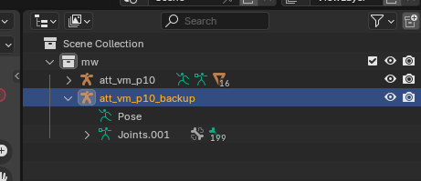

以上图为例

- `att_vm_p10_backup` 备份的fennec45的骨架，包含完整的武器骨骼手臂骨骼
- `att_vm_p10` 用于分离武器骨骼的骨架

隐藏`att_vm_p10_backup`骨架，我们现在开始在`att_vm_p10`骨架中分离武器骨骼。

如果有动画我们先将其删除，并重置回默认姿态

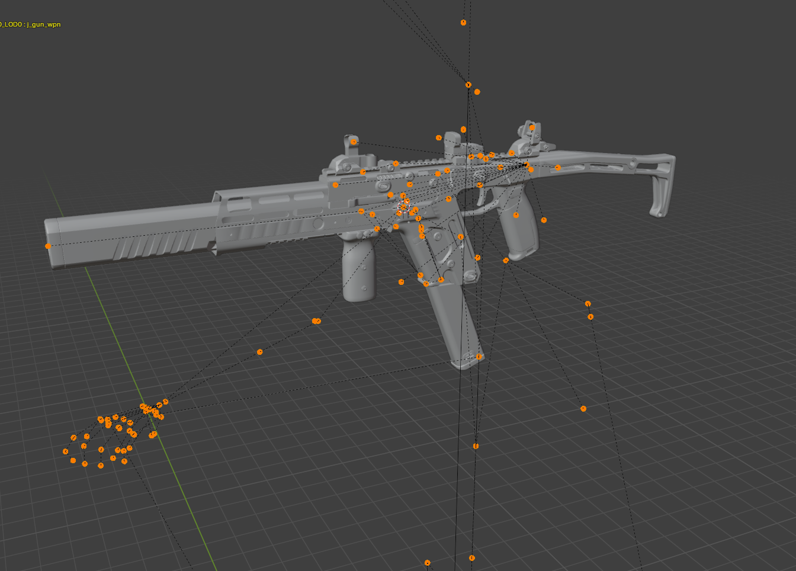

以cod的骨架来说`j_gun`及其所有子级骨骼都是武器骨骼，我们只需要找到这个骨骼，然后删除除了其本身和其所有子级骨骼即可。至于其他不同游戏的武器的骨架骨骼就需要你自己找了。

在编辑模式下，找到`j_gun`并选中，`Shfit + G`然后选择"相似 子级"，接着`Ctrl +I`反选所有其他骨骼，再按`Del`删除骨骼

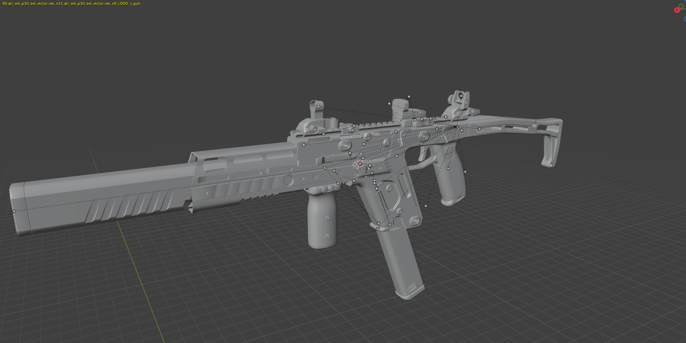

这样我们就得到了只有武器骨骼的骨架了。

## 3.2 导入TTF2原本的武器骨架，调整自定义武器大小位置 {#adjust-pos-and-size}

<!-- 让我们新建一个Blender工程文件，起名为`combineSkn.blend`,同样放到我们之前的`blendProject`文件夹下面。 -->

首先让我们把原本r97的骨架和模型复制过来，你可以选择直接在blender中从我们之前的`ogwpn.blend`项目里中复制，或者从我们之前反编译出来的r97的smd文件导入。

在这里我选择重新导入smd文件，只要确保把网格和骨架导进来就行（记得导入时候选`Make new armature`!）

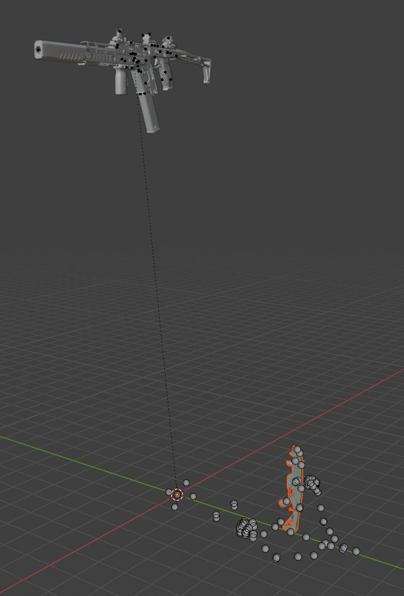

此时我们要开始调整自定义武器的骨架和网格大小，还有位置，使其尽可能贴近到TTF2原本的武器骨架的位置。

::: warning
注意不能修改原本来自TTF2的骨架和骨骼，否则会导致后面动画错误
:::

缩放自定义武器大小时候请**记录下这个值**，我们后面还需要用到这个值。这个值不是固定的，因为不同武器的模型大小不同，所以需要根据实际情况调整。比如我这里是0.4

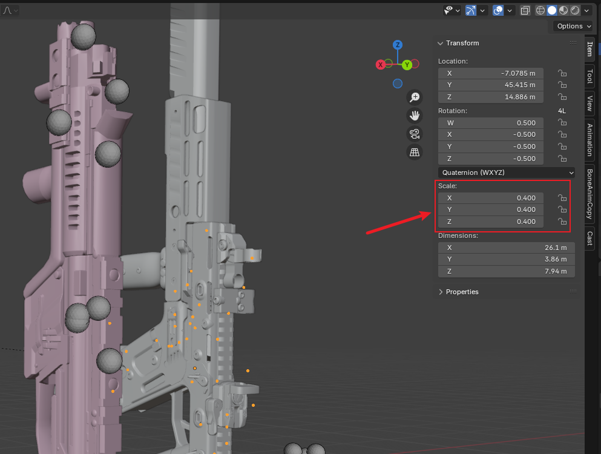

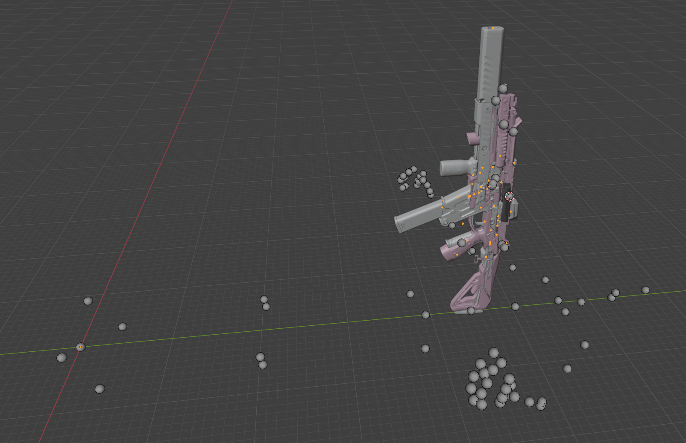

调整自定义武器位置，使其尽可能贴近到TTF2原本的武器骨架的位置。

调整差不多好后，我们全选中所有自定义武器的网格和骨架按`Ctrl + A`，然后选择"应用位置" "应用旋转" "应用缩放" "应用所有变换"

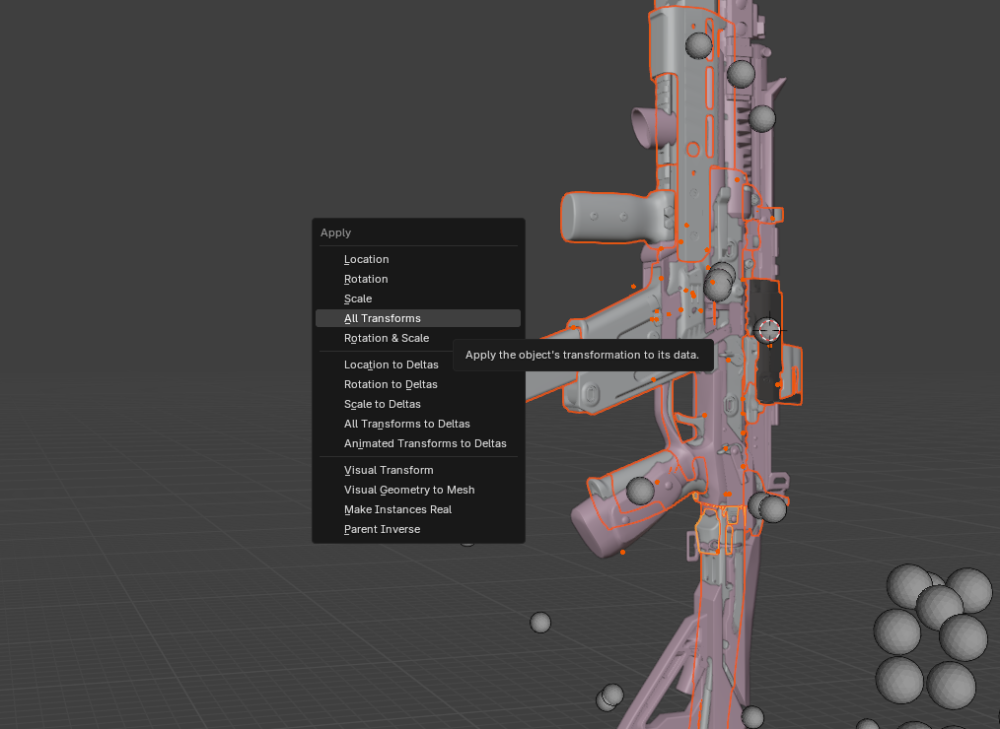

## 3.3 合并骨架，设置好骨骼父子级

现在我们来合并骨架，先选中原本的r97骨架，然后再选择fennec45的武器骨架，按`Ctrl + J`合并骨架

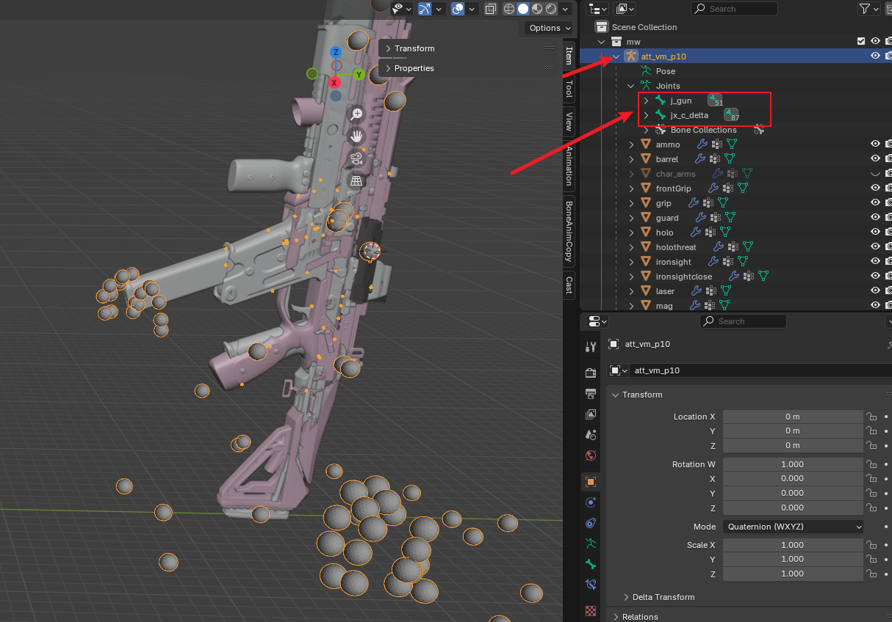

此时如图我们应该就能看到fennec45骨架里有原本r97骨架的骨骼了。

我们接下来将r97的武器骨骼作为fennec45武器骨骼的父级。

选择骨架切换到编辑模式下，找到自定义武器的根骨骼，在这里是`j_gun`，设置其父级骨骼为`weapon_bone`

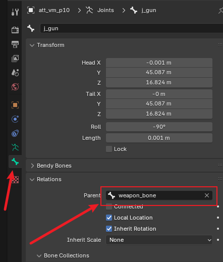

`weapon_bone`是TTF2的骨架中武器根骨骼

此时我们可以选中骨架，按`G`,如果此时移动鼠标骨架和武器模型会一起移动，说明父子级设置正确。

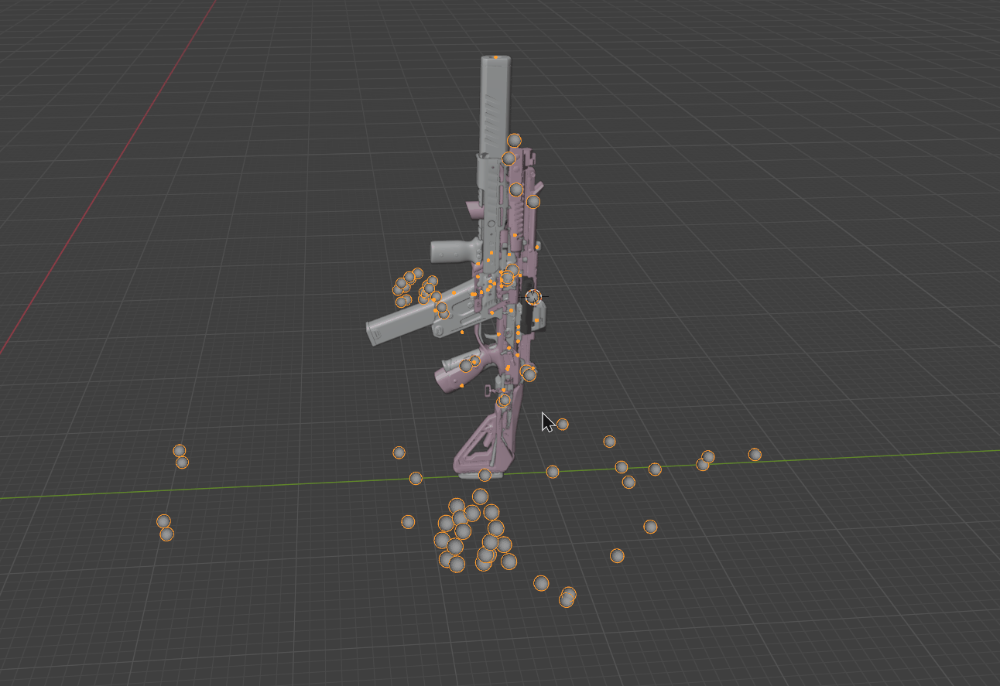

此时我们就完成了骨架合并。现在此项目中，包含了同时拥有TTF2原本武器的所有骨骼和自定义武器的武器骨骼的骨架，还有与之对应的模型网格。

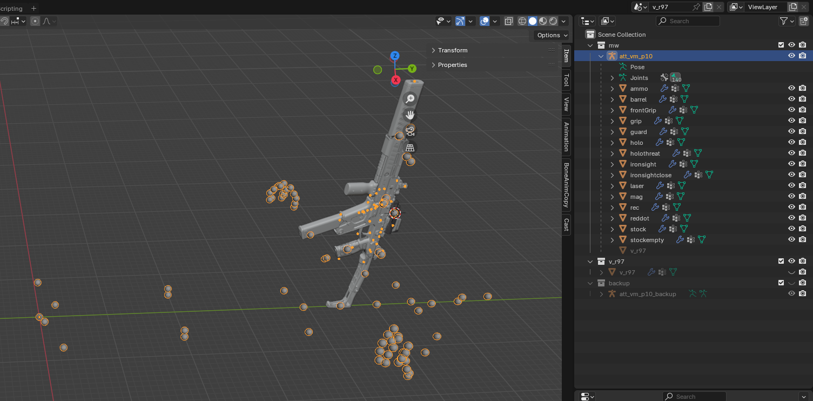

## 3.4 其他处理

到现在你可以再进行一下其他处理，比如添加其他骨骼，调整骨骼父子级，添加其他网格模型之类等等。

- 枪口火焰的骨骼
- 抛壳的骨骼

比如我之后会使用到blender的IK辅助动画制作，所以在这里我将骨架里左右肘关节的骨骼父级修改了一下，如`def_l_elbow`的父级骨骼改为`def_l_shoulder`。（此操作不是必须的）

之后我们大部分的项目操作都将使用此工程里的骨架和网格，让我们保存并备份这个blender工程文件，名字为`combineSkn.blend`

