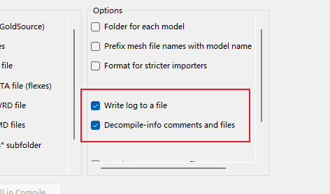

# 4. 处理动画

接下来开始我们最麻烦痛苦的阶段：处理武器所有的动画。

什么情况下我们需要处理动画？

- 情况1，你想要制作替原本动画
- 情况2，你改变了武器原本的骨架骨骼

对于情况1，既然你都要替换原本的动画了，那肯定要去对动画进行处理修改了。

对于情况2，只要你涉及了骨架的修改，例如增加了骨骼，那么你一定就得对许多原本的动画进行处理修复了，至于为什么我们下面会讲。


## 4.1 首先你先需要了解的东西

我们之前反编译r97出来的所有动画文件都在`decompile_ptpov\ptpov_r97_anims`目录下，对于其他武器也是类似的，都是在范反编译目录下的`XXX_anims`文件夹下。

你可以看到里面将近有120多个动画文件，数量是L4D2的将近10倍！

但实际上我们并不需要完全处理重做每一个动画文件，那会耗费非常多的时间。

### 4.1.1 非delta动画 和 delta动画

所有这些动画文件分为两个大类：**`非delta动画`** 和 **`delta动画`**

这个`delta动画`你可以理解为混合动画或叠加动画，他们用于在已播放的动画上面叠加组合播放，例如游戏里武器的待机动画，开火动画。

而`非delta动画`则是那些完整独立的动画，他们单独播放就能够得到最终的效果，例如游戏里武器的换弹动画。这些动画我们直接根据你想要实现的效果进行替换或者修改就行了

------


delta动画是很好，他降低了许多工作量，例如实现武器的待机动画，开火动画等都非常方便，但对于我们替换了武器网格和武器骨架之后来说，delta动画会导致灾难。

为什么呢？这其实和delta动画在游戏里的工作原理有关系。

这些delta动画里都是基于原本武器骨架的动画，自然工作起来没问题。**但假如我们修改了武器的骨架，添加了骨骼，这些新添加的骨骼在这些delta动画里是没有定义没有数据的。如果直接使用这些delta动画那么游戏里就会直接破坏整个动画，导致骨骼乱飞。**

那么我们要怎么解决这个问题呢？ 方法简单但麻烦，就是把所有delta动画找出来，并添加上和新的武器骨骼骨骼数据。具体如何操作，后面会讲。


## 4.2 将动画文件分类

知道了上面这些信息后，我们需要先将动画文件进行分类。分出非delta动画和delta动画。

我们可以根据反编译时候得到的文件信息进行分类。

需要确保你的的动画文件是由`Crowbar`反编译得到的，且反编译时勾选了"Decompile-info comments and files"选项。


如果以上设置无误，则得到动画文件打开后里面会有类似以下带有注释信息
```
    0 0.000000 0.000000 0.000000 0.000000 0.000000 -1.570796   # pos: desc_delta   rot: desc_delta
    1 0.000000 0.000000 0.000000 0.000000 0.000000 0.000000   # pos: desc_delta   rot: desc_delta
    2 0.000000 0.000000 0.000000 0.000000 0.000000 0.000000   # pos: delta   rot: anim
    3 0.000000 0.000000 0.000000 0.000000 0.000000 0.000000   # pos: desc_delta   rot: desc_delta
```

我们使用脚本`CategAnimFile.bat`来帮我们分类出这些动画文件，脚本可以在[这里下载](https://raw.githubusercontent.com/HK560/R2Chef/refs/heads/main/tools/script/CategAnimFile.bat)。

将其放置到动画文件夹的路径下

```
Fennec45\decompile_ptpov\ptpov_r97_anims
├── CategAnimFile.bat
├── drawfirst_crouch_seq.smd
├── ads_in_anim_alt1.smd
├── ads_in_anim_alt2.smd
├── ads_in_anim_alt3.smd
├── ......
```
双击运行此脚本, 按任意键继续，等待脚本运行，运行成功会显示类似以下内容
```cmd
......
Copied 44 files to deltaFile.
Copied 80 files to nodeltaFile.
```

完成后会在当前目录下新建两个文件夹`deltaFile`和`nodeltaFile`，里面分别存放了delta动画和非delta动画。

<!--  -->


```
Fennec45\decompile_ptpov\ptpov_r97_anims
├── deltaFile
|  ├── aog_anim.smd
|  ├── attack_ads_anim.smd
|  ├── ......
|  ├── walk_anim_nocam.smd
|  └── walk_anim_static.smd
├── nodeltaFile
|  ├── ads_in_anim.smd
|  ├── ads_in_anim_alt1.smd
|  ├── ......
|  ├── wind_loop_ads_anim_layer.smd
|  └── wind_loop_anim_layer.smd
├── ads_in_anim.smd
├── ads_in_anim_alt1.smd
├── ads_in_anim_alt2.smd
├── ......
```
这样我们就完成了动画文件的分类。
