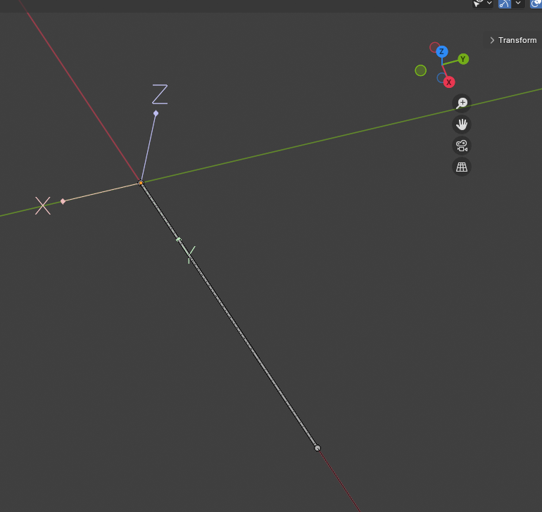
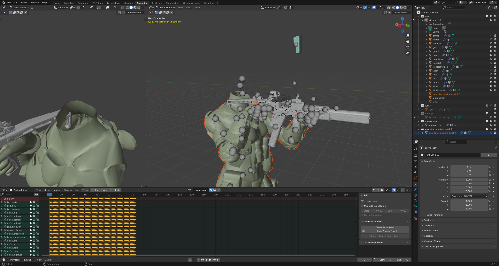
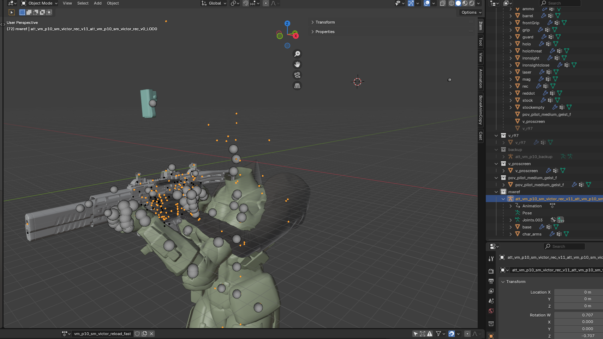
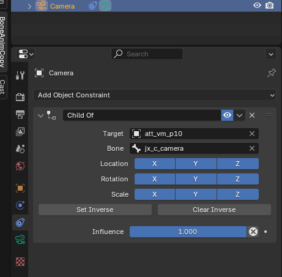

# 4. 处理动画

接下来开始我们最麻烦痛苦的阶段：处理武器所有的动画。

什么情况下我们需要处理动画？

- 情况1，你想要制作替原本动画
- 情况2，你改变了武器原本的骨架骨骼

对于情况1，既然你都要替换原本的动画了，那肯定要去对动画进行处理修改了。

对于情况2，只要你涉及了骨架的修改，例如增加了骨骼，那么你一定就得对许多原本的动画进行处理修复了，至于为什么我们下面会讲。


## 4.1 首先你先需要了解的东西

我们之前反编译r97出来的所有动画文件都在`decompile_ptpov\ptpov_r97_anims`目录下，对于其他武器也是类似的，都是在反编译目录下的`XXX_anims`文件夹下。

你可以看到里面将近有120多个动画文件，数量是L4D2的将近10倍！

但实际上我们并不需要完全处理重做每一个动画文件，那会耗费非常多的时间。

### 4.1.1 非delta动画 和 delta动画

所有这些动画文件分为两个大类：**`非delta动画`** 和 **`delta动画`**

这个`delta动画`你可以理解为混合动画或叠加动画，他们用于在已播放的动画上面叠加组合播放，例如游戏里武器的待机动画，开火动画。

而`非delta动画`则是那些完整独立的动画，他们单独播放就能够得到最终的效果，例如游戏里武器的换弹动画。这些动画我们直接根据你想要实现的效果进行替换或者修改就行了

------


delta动画是很好，他降低了许多工作量，例如实现武器的待机动画，开火动画等都非常方便，但对于我们替换了武器网格和武器骨架之后来说，delta动画会导致灾难。

为什么呢？这其实和delta动画在游戏里的工作原理有关系。

这些delta动画里都是基于原本武器骨架的动画，自然工作起来没问题。**但假如我们修改了武器的骨架，添加了骨骼，这些新添加的骨骼在这些delta动画里是没有定义没有数据的。如果直接使用这些delta动画那么游戏里就会直接破坏整个动画，导致骨骼乱飞。**

那么我们要怎么解决这个问题呢？ 方法简单但麻烦，就是把所有delta动画找出来，并添加上和新的武器骨骼骨骼数据。具体如何操作，后面会讲。


## 4.2 将动画文件分类

知道了上面这些信息后，我们需要先将动画文件进行分类。分出非delta动画和delta动画。

我们可以根据反编译时候得到的文件信息进行分类。

需要确保你的的动画文件是由`Crowbar`反编译得到的，且反编译时勾选了"Decompile-info comments and files"选项。


如果以上设置无误，则得到动画文件打开后里面会有类似以下带有注释信息
```
    0 0.000000 0.000000 0.000000 0.000000 0.000000 -1.570796   # pos: desc_delta   rot: desc_delta
    1 0.000000 0.000000 0.000000 0.000000 0.000000 0.000000   # pos: desc_delta   rot: desc_delta
    2 0.000000 0.000000 0.000000 0.000000 0.000000 0.000000   # pos: delta   rot: anim
    3 0.000000 0.000000 0.000000 0.000000 0.000000 0.000000   # pos: desc_delta   rot: desc_delta
```

我们使用脚本`CategAnimFile.bat`来帮我们分类出这些动画文件，脚本可以在[这里下载](https://raw.githubusercontent.com/HK560/R2Chef/refs/heads/main/tools/script/CategAnimFile.bat)。

脚本代码如下：
```bat:line-numbers [范例]
@echo off
echo This script is written by HK560 and it copies delta animation files to deltaFile and others to nodeltaFile.
echo Animation files need to be decompiled by Crowbar with "Decompile-info comments and files" option enabled.
echo Please place this script in the animation files directory and run it.

pause  

setlocal enabledelayedexpansion

set "dir=%cd%"
set "deltaFile=%dir%\deltaFile"
set "nodeltaFile=%dir%\nodeltaFile"

if not exist "%deltaFile%" mkdir "%deltaFile%"
if not exist "%nodeltaFile%" mkdir "%nodeltaFile%"

set /a deltaCount=0
set /a nodeltaCount=0

for %%f in (*.smd) do (
    set "desc_delta="
    for /f "usebackq delims=" %%i in ("%%f") do (
        set "line=%%i"
        if "!line:desc_delta=!" neq "!line!" set "desc_delta=1"
    )
    if defined desc_delta (
        copy "%%f" "%deltaFile%\%%f"
        set /a deltaCount+=1
    ) else (
        copy "%%f" "%nodeltaFile%\%%f"
        set /a nodeltaCount+=1
    )
)

echo Copied %deltaCount% files to deltaFile.
echo Copied %nodeltaCount% files to nodeltaFile.
pause
```

将脚本放置到动画文件夹的路径下

```
Fennec45\decompile_ptpov\ptpov_r97_anims
├── CategAnimFile.bat
├── drawfirst_crouch_seq.smd
├── ads_in_anim_alt1.smd
├── ads_in_anim_alt2.smd
├── ads_in_anim_alt3.smd
├── ......
```
双击运行此脚本, 按任意键继续，等待脚本运行，运行成功会显示类似以下内容
```cmd
......
Copied 44 files to deltaFile.
Copied 80 files to nodeltaFile.
```

完成后会在当前目录下新建两个文件夹`deltaFile`和`nodeltaFile`，里面分别存放了delta动画和非delta动画。

<!--  -->


```
Fennec45\decompile_ptpov\ptpov_r97_anims
├── deltaFile
|  ├── aog_anim.smd
|  ├── attack_ads_anim.smd
|  ├── ......
|  ├── walk_anim_nocam.smd
|  └── walk_anim_static.smd
├── nodeltaFile
|  ├── ads_in_anim.smd
|  ├── ads_in_anim_alt1.smd
|  ├── ......
|  ├── wind_loop_ads_anim_layer.smd
|  └── wind_loop_anim_layer.smd
├── ads_in_anim.smd
├── ads_in_anim_alt1.smd
├── ads_in_anim_alt2.smd
├── ......
```
这样我们就完成了动画文件的分类。

那么接下来我就要来分别处理非delta动画和delta动画了。

## 4.3 最后检查！

到这里，请你对骨架骨骼做最后的检查，确保没有缺漏骨骼。检查模型顶点组，是否正确映射到骨架。

**在此之后就不能再修改骨架骨骼了，否则会破坏动画只能重头再来。**

如果你想对骨架进行修改请在下一节内容开始前完成。

## 4.4 初步处理delta动画

复制一个我们之前合并好骨骼骨架的工程文件(也就是`combineSkn.blend`),改名为`deltaHandler.blend`，然后打开

::: tip 删除骨骼小球
骨架的小球球比较碍眼，可以进行如下操作删除：

选中骨架，切换到姿态模式，选中一个骨骼，再按`A`全选骨骼，再在右边属性面板找到骨骼->视图形状->自定义视图，然后删掉`smd_bone_vis`

然后按`Ctrl + C` 出现`Copy Attributes`菜单，选择`Copy bone shape` 即可。

如果按不出这个菜单请去安装此插件[Copy Attributes Menu](https://extensions.blender.org/add-ons/copy-attributes-menu/)


:::


接下来要初步处理delta动画了,请仔细遵循我的操作：

我们的目标是，将所有骨骼位置都调整到世界原点，并调整轴向。骨骼的+X轴指向世界的-Y轴，+Y轴指向世界的+X轴，+Z轴指向世界的+Z轴。

### 4.4.1 调整骨架所有骨骼的位置和旋转

在右面属性打开骨骼轴向显示


然后我们找到`jx_c_delta`这个骨骼，这个骨骼应该是骨架的根骨骼


此时他应该是+Y轴指向世界的+Y轴，我们要将其以世界的Z轴顺时针旋转90度，使其+Y轴指向世界的+X轴。

**姿态模式**下选中此骨骼按`R` 再按`Z`,然后输入`-90`回车即可



ok此时此`jx_c_delta`骨骼位置就是正确的，我们接下来让其他骨骼复制其位置和旋转即可。

同样也是要用到`Copy Attributes Menu`

-------
1. 复制位置

选中`jx_c_delta`骨骼，再按`A`选中所有其他骨骼，按`Ctrl + C` 出现`Copy Attributes`菜单，选择`Copy Visual Location`，**然后重复多次`Copy Visual Location` 直到所有骨骼的位置都和`jx_c_delta`骨骼位置一致。**


-------
2. 复制旋转

类似的,选中`jx_c_delta`骨骼，再按`A`选中所有其他骨骼，按`Ctrl + C` 出现`Copy Attributes`菜单，选择`Copy Visual Rotation`，**然后重复多次`Copy Visual Rotation` 直到所有骨骼的旋转都和`jx_c_delta`骨骼旋转一致。**


现在，你所有的骨骼应该都是以世界原点为位置，+X轴指向世界的-Y轴，+Y轴指向世界的+X轴，+Z轴指向世界的+Z轴。


**此时我们全选骨骼，再`Ctrl+A`,将此姿态应用为默认姿态**，然后网格的位置就会被重置掉了，但没关系，后续步骤我们用不到模型网格。你完全可以在此工程项目里删掉这些网格。

现在你可以保存一下工程文件，或者备份一下此工程文件。


### 4.4.2 导入所有delta动画转换导出

接下来我们导入所有的delta动画


然后就可以在动作编辑器里面看到一堆的动画里了。

**我们不要对动画进行任何编辑，我们只需要将其全部重新导出即可。**


在右边找到`Source Engine Export`，按如图进行配置


然后确保在姿态模式下，在动作编辑器中选中动画，然后在右侧面板点击导出。对所有导入的delta动画都进行如此操作！


有将近30个delta动画都需要重复上述操作进行导出！耐心一点！

如果你按照上述我的配置进行导出，那么导出的delta文件的应该是在`decompile_ptpov\anims`目录下。其实你还可以检查一下数量，和原来`decompile_ptpov\ptpov_r97_anims\deltaFile`文件夹里的文件数量是否一致。

这些重新导出的delta文件里包含了我们组合好的骨骼数据和原本的动画数据，我们之后新骨架使用这些delta文件就可以正常工作了。

之后我们还会再回来修改部分delta动画的。

## 4.5 分类非delta动画

那么我们的大头工作还是在处理非delta动画上。毕竟那些换弹动画什么的都是非delta动画，都是要重新做的。

先看看我们有哪些非delta动画吧，我都在下面分类好并说明了

```
- 进入开镜动画
    ads_in_anim.smd
    ads_in_anim_alt1.smd
    ads_in_anim_alt2.smd
    ads_in_anim_alt3.smd
- 单手持枪 进入开镜动画
    ads_in_onehanded_anim.smd
    ads_in_onehanded_anim_alt1.smd
    ads_in_onehanded_anim_alt2.smd
    ads_in_onehanded_anim_alt3.smd
- 滑铲/蹲下 进入开镜动画
    ads_in_slide_anim.smd
    ads_in_slide_aog_anim.smd
    ads_in_slide_hcog_anim.smd
    ads_in_slide_holo_anim.smd
- 退出开镜动画
    ads_out_anim.smd
    ads_out_anim_alt1.smd
    ads_out_anim_alt2.smd
    ads_out_anim_alt3.smd
- 单手持枪 退出开镜动画
    ads_out_onehanded_anim.smd
    ads_out_onehanded_anim_alt1.smd
    ads_out_onehanded_anim_alt2.smd
    ads_out_onehanded_anim_alt3.smd
- 滑铲/蹲下 退出开镜动画
    ads_out_slide_anim.smd
    ads_out_slide_aog_anim.smd  # 对应aog镜子
    ads_out_slide_hcog_anim.smd # 对应hcog镜子
    ads_out_slide_holo_anim.smd # 对应holo镜子
- 切枪动画
    draw_crouch_seq.smd             # 蹲姿切枪
    draw_onehanded_crouch_seq.smd   # 单手持枪蹲姿切枪
    draw_onehanded_seq.smd          # 单手持枪切枪
    draw_seq.smd                    # 正常切枪
- 首次切枪动画
    drawfirst_crouch_seq.smd    # 蹲姿首次切枪
    drawfirst_onehanded_seq.smd # 单手持枪蹲姿首次切枪
    drawfirst_seq.smd           # 正常首次切枪
- 持枪动画 （未使用）
    holster_onehanded_seq.smd   # 单手持枪持枪
    holster_seq.smd             # 正常持枪
- 其他（nod）
    idle_check_anim_nod.smd # 待机检查
    iron_anim_nod.smd       # 待机动画
- 放下枪
    lower_onehanded_seq.smd # 单手持枪放下枪
    lower_seq.smd           # 正常放下枪
- 举枪动画
    raise_crouch_seq.smd            # 蹲姿举枪
    raise_frommelee_crouch_seq.smd  # 蹲姿从近战状态切换到举枪
    raise_frommelee_seq.smd         # 正常从近战状态切换到举枪
    raise_frommelee_sliding_seq.smd # 滑铲/蹲下从近战状态切换到举枪
    raise_onehanded_crouch_seq.smd  # 单手持枪蹲姿 举枪
    raise_onehanded_seq.smd         # 单手持枪 举枪
    raise_seq.smd                   # 正常举枪
- 换弹动画
    reload_crouch_seq.smd                           # 蹲姿 完整换弹
    reload_empty_crouch_seq.smd                     # 蹲姿 空弹夹换弹
    reload_empty_late1_anim.smd                     # 空弹夹换弹 延迟1
    reload_empty_late1_crouch_anim.smd              # 蹲姿 空弹夹换弹 延迟1
    reload_empty_late2_anim.smd                     # 空弹夹换弹 延迟2
    reload_empty_late2_crouch_anim.smd              # 蹲姿 空弹夹换弹 延迟2
    reload_empty_seq.smd                            # 空弹夹换弹
    reload_late1_anim.smd                           # 换弹 延迟1
    reload_late1_crouch_anim.smd                    # 蹲姿 换弹 延迟1
    reload_onehanded_crouch_seq.smd                  # 单手持枪蹲姿 换弹
    reload_onehanded_empty_crouch_seq.smd            # 单手持枪蹲姿 空弹夹换弹
    reload_onehanded_empty_late1_anim.smd            # 单手持枪 空弹夹换弹 延迟1
    reload_onehanded_empty_late1_crouch_anim.smd     # 单手持枪蹲姿 空弹夹换弹 延迟1
    reload_onehanded_empty_late2_anim.smd            # 单手持枪 空弹夹换弹 延迟2
    reload_onehanded_empty_late2_crouch_anim.smd     # 单手持枪蹲姿 空弹夹换弹 延迟2
    reload_onehanded_empty_seq.smd                   # 单手持枪 空弹夹换弹
    reload_onehanded_late1_anim.smd                  # 单手持枪 换弹 延迟1
    reload_onehanded_late1_crouch_anim.smd           # 单手持枪蹲姿 换弹 延迟1
    reload_onehanded_seq.smd                         # 单手持枪 换弹
    reload_seq.smd                                   # 正常换弹
- 冲刺循环动画
    sprint_onehanded_seq.smd                         # 单手持枪 冲刺
    sprint_seq.smd                                   # 正常冲刺
- 开始冲刺动画
    sprintdraw_onehanded_seq.smd                     # 单手持枪 冲刺举枪
    sprintdraw_seq.smd                               # 正常冲刺举枪
    sprintholster_onehanded_seq.smd                   # 单手持枪 冲刺收枪
    sprintholster_seq.smd                             # 正常冲刺收枪
    sprintraise_onehanded_seq.smd                     # 单手持枪 冲刺举枪
    sprintraise_onehanded_slide_anim.smd              # 单手持枪 滑铲/蹲下 冲刺举枪
    sprintraise_seq.smd                               # 正常冲刺举枪
    sprintraise_seq_air.smd                           # 正常冲刺举枪 空中
    sprintraise_seq_regrip.smd                        # 正常冲刺举枪 重力枪
- 切换到单手/双手持枪动画
    switch_to_onehanded_anim.smd                    # 切换到单手持枪
    switch_to_twohanded_anim.smd                    # 切换到双手持枪
- 没有采用的动画（未使用）
    wind_loop_ads_anim_layer.smd 
    wind_loop_anim_layer.smd 

```

不同武器可能动画会有不同，其实如果不确定动画是用在哪的，可以导入到blender里确认。

------

那么现在我们就得确认一下我们要修改哪些文件了。

首先我们站姿的举枪动画来自于退出关镜动画的最后一帧，比如`ads_out_anim.smd`的最后一帧。所有不可避免的，我们得修改开镜动画和关镜动画，也包括蹲姿的、单手持枪的。哦对了那些`alt`结尾的动画其实是重复的，所以我们做好一个复制改名为alt的就行了。

持枪动画没有用到可以不用改，其他的切枪动画、首次切枪动画、放下枪动画，举枪动画，换弹动画，冲刺动画，切换到单手/双手持枪动画，这些动画我们都需要修改。


部分动画其实可以复用，比如举枪动画，切枪动画，站姿蹲姿单手都公用一套效果不会太差。如果你想要做的更细节一点那也可以选择全部重做。


## 4.6 重做动画

ok，现在我们开始重做动画。在最开始我们可以先简单只重做几个动画，然后尝试打包进初步验证有没有什么其他问题。

让我们先以重做非delta动画的换弹动画举例！{#my-anchor}

在本教程例子中，我是计划将MW中Fennec45的动画移植过来，所以接下来我会使用一些其他工具来实现动画跨不同骨架的移植。

但是大家制作武器mod并非都是移植动画，也完全可以自己制作动画，因此并不需要完全参照我的过程，请自行判断需要采取哪些步骤，最终目的都是为当前骨架当前武器重做一套合适的动画。

无论如何，以下是我的工作流程：

------
1. 复制`combineSkn.blend`项目，改名为`animHandler.blend`，然后打开。
2. 选中骨架，导入所有的非delta动画。再导入我们之前提取出来的手臂模型。
   
3. 打开`mwWeaponWithArm.blend`工程，把来自mw的武器网格，手臂网格还有骨架复制粘贴进`animHandler.blend`工程。然后调整大小比例和位置到合适位置的，大小比例在我这里是`0.4`,这个是来自我们之前在[第三章合并骨架时](./3.md#adjust-pos-and-size)候算出来的。
   
4. 调整一下骨骼视图删掉小球，添加个相机，给相机添加个子级约束修改器，绑在`jx_c_camera`骨骼上，调整到世界原点方向没错即可。还可以添加几个方块辅助动画视图。
   

   

5. 在这里，我使用了[Bone Animation Copy Tool](https://github.com/kumopult/blender_BoneAnimCopy)这个工具来将MW骨骼的动画映射到我们当前的组合后骨架上。我不会详细介绍这个插件如何使用，如果你有兴趣可以尝试安装使用。
   
   
   
   
   
   
   
   
   