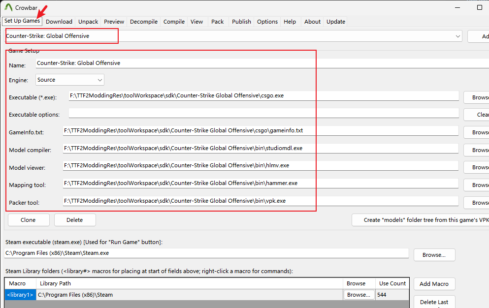
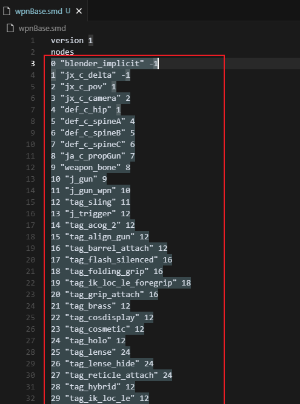
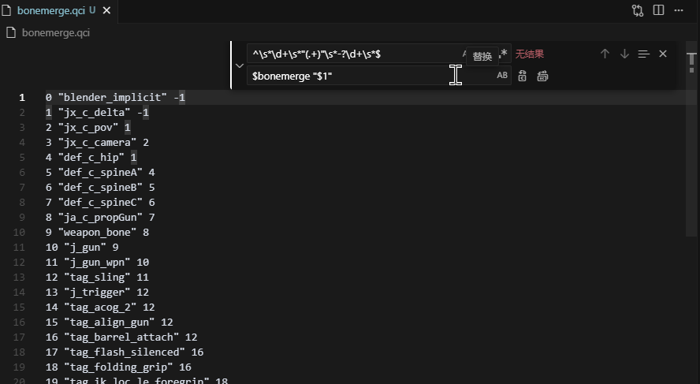
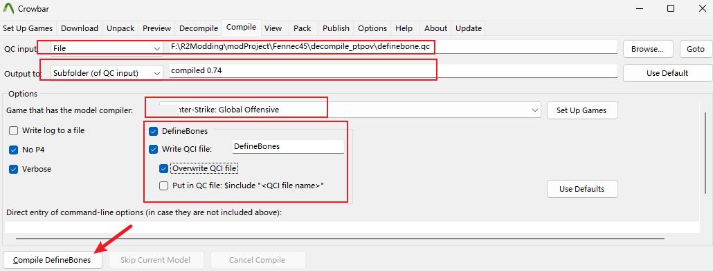
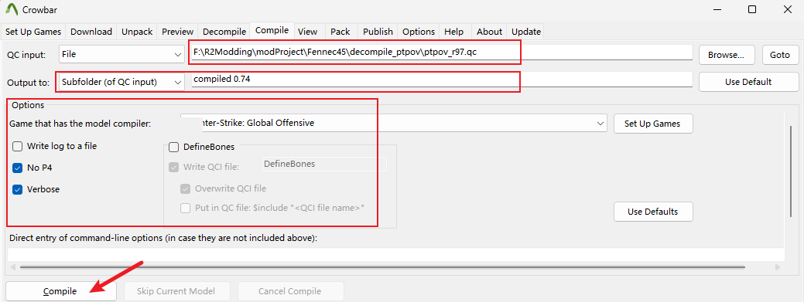
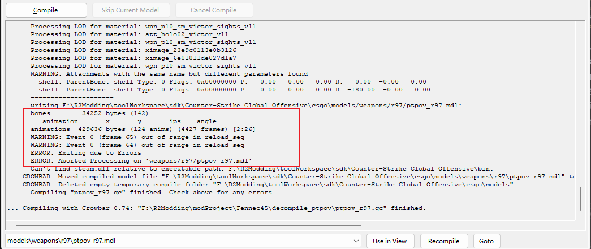
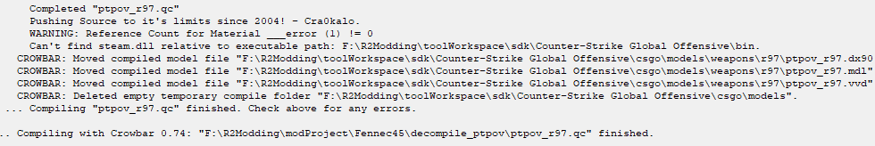

# 导入进游戏

这一章节将介绍如何将我们制作好的武器和动画编译打包进游戏里。你可以在制作动画或或测试模型的时候就进行这一步，方便你直观地看到效果。


## 5.0 准备工作

我们之后将使用Crowbar来进行编译qc，但首先我们需要为Crowbar配置SDK，用于之后`Compile`时使用。

通常来说SDK你可以使用《Source Filmmaker》或者《传送门2》的SDK来编译泰坦陨落的MDL文件，他们是最接近泰坦陨落的SDK。但在这里我推荐使用由Cra0修改过的CSGO的SDK，因为它解除了一些限制，例如骨骼数材质数。你可以在[这里下载](https://ghfast.top/https://raw.githubusercontent.com/HK560/R2Chef/refs/heads/main/tools/SDK/CSGO_Custom_SDK.zip)

然后在Crowbar中进行配置SDK即可



## 5.1 编辑QC文件

让我们先处理打包第一人称的武器模型，还记得我们之前反编译的`ptpov_r97.mdl`吗，我们将其反编译到了`decompile_ptpov`文件夹里。

我们打开`decompile_ptpov`文件夹，找到里面的`ptpov_r97.qc`文件，使用文件编辑器打开，我比较喜欢使用VSCode。对于其他武器反编译后也是类似的，找到以`.qc`结尾的文件就是了。

接下来我们要以这个qc文件为中心修改，编辑qc文件并添加和编辑相关的一些文件，最后使用`Crowbar`配合兼容的SDK编译回MDL文件。

### 5.1.1 修改编译限制，替换模型文件

首先在`$modelname`下面添加一行`$maxverts  9999999`，这是为了提高模型顶点数量限制，后面的数值只要比你所有模型加起来的顶点数高就行。


```qc{5}
// Created by Crowbar 0.74

$modelname "weapons/r97/ptpov_r97.mdl" 

$maxverts  9999999 // [!code focus] [!code ++]

//$fadedist -1

```

然后我们编辑`$bodygroup`的相关内容，替换里面的studio指向的文件为我们自己的武器模型文件，注意bodygroup的变量名不能改，但是studio的变量名可以改，例如以下这是我自己的修改。记得武器本体和瞄准镜模型要区分开来放到对应的bodygroup里。


```qc
$bodygroup "ptpov_r97"
{
    studio "v_r97.smd" // [!code --]
	studio "wpnBase.smd" // [!code ++]
}
$bodygroup "proscreen"
{
	blank
	studio "v_proscreen.smd" // [!code --]
	studio "v_proscreenN.smd" // [!code ++]
}
$bodygroup "sight_holo"
{
	blank
	studio "v_holo.smd" // [!code --]
	studio "reddot.smd" // [!code ++]
}
```

::: tip
记得把这些模型smd文件放在qc文件同目录下
:::

然后找到`$sectionframes`, 调大其动画的帧数限制，不小于你最长动画的帧数。如果没有`$sectionframes` 则自行添加即可。

```qc
$bonemerge "ja_l_propHand"
$bonemerge "ja_r_propHand"


$sectionframes 30 190 // [!code focus] [!code --]
$sectionframes 30 9999999 // [!code focus] [!code ++]


$poseparameter "sprintfrac" 0 1 loop 0
$poseparameter "velocity" 0 173 loop 0
$poseparameter "ads_blend" 0 1 loop 0
```

### 5.1.2 处理`$bonemerge`

因为我们已经对模型骨架进行修改了，qc文件里原来定义的已经不适用了。我们需要重新定义骨架。Crowbar能够帮助我们完成这个工作。

在`decompile_ptpov`下新建个`bonemerge.qci`文件并打开

然后我们再用文本编辑器打开我们自己的模型smd文件，例如我这里的"wpnBase.smd"，找到类似以下部分



复制到`bonemerge.qci`里面

然后使用VSCode打开`bonemerge.qci`，使用正则表达式匹配搜索，搜索`^\s*\d+\s*"(.+)"\s*-?\d+\s*$`，然后替换为`$bonemerge "$1"`



然后删掉或注释原本QC里的所有`$bonemerge`内容，然后添加`$include "bonemerge.qci"`

```qc

// $bonemerge "def_l_ankle" // [!code focus] [!code --]
// $bonemerge "def_l_ball" // [!code focus] [!code --]
// $bonemerge "def_l_kneeB" // [!code focus] [!code --]
// $bonemerge "def_r_thigh" // [!code focus] [!code --]
// $bonemerge "def_r_knee" // [!code focus] [!code --]
// $bonemerge "def_r_ankle" // [!code focus] [!code --]
// $bonemerge "def_r_ball" // [!code focus] [!code --]
// $bonemerge "def_r_kneeB" // [!code focus] [!code --]
// $bonemerge "ja_l_propHand" // [!code focus] [!code --]
// $bonemerge "ja_r_propHand" // [!code focus] [!code --]

$include "bonemerge.qci" // [!code focus] [!code ++]

```
### 5.1.3 处理`$definebone`

`$definebone` 用于定义骨架信息，但是因为我们已经修改过了骨架了，需要重新生成骨架定义信息。


首先在`decompile_ptpov`下新建个`definebone.qc`文件，内容模板如下：
```qc
$maxverts  9999999
$modelname "definebone/tmp.mdl"
$model "definebone" "wpnBase.smd" // "wpnBase.smd" 替换为你自己的模型文件
$include "bonemerge.qci"
$sequence "tmpSeq" "wpnBase.smd" //"wpnBase.smd" 替换为你自己的模型文件
```
保存此文件

然后我们使用Crowbar来重新生成骨架定义信息，切到`Compile`选项卡，如图选择上面创建编辑保存后的`definebone.qc`文件，选择SDK，勾上"DefineBones", 如图进行配置，然后点击编译。



顺利的话你就能在`decompile_ptpov`下看到一个`DefineBones.qci`文件，这个文件里面包含了生成的骨架定义信息。

我们回到qc文件，删掉或注释原本所有`$definebone`内容，添加一行`$include "DefineBones.qci"`

```qc
// $definebone "def_c_acgs" "ja_ads_attachment" 0 0 0 0 0 0 0 0 0 0 0 0 // [!code focus] [!code --]
// $definebone "def_c_sight_on" "def_c_base" 0 4.826065 13.175632 0 0 0 0 0 0 0 0 0 // [!code focus] [!code --]
// $definebone "def_c_detailC" "def_c_base" 0.518038 4.908905 -0.759142 0 0 0 0 0 0 0 0 0 // [!code focus] [!code --]
// $definebone "def_c_detailD" "def_c_base" 0 4.760376 -0.677589 0 0 0 0 0 0 0 0 0 // [!code focus] [!code --]
// $definebone "shell" "def_c_base" -0.61704 3.532082 7.561152 0 149.999956 179.99995 0 0 0 0 0 0 // [!code focus] [!code --]
// $definebone "muzzle_flash" "def_c_base" 0 3.288845 17.839268 -89.999962 0 0 0 0 0 0 0 0 // [!code focus] [!code --]
// $definebone "flashlight" "def_c_base" -1.714871 3.208477 16.033394 -89.999962 0 0 0 0 0 0 0 0 // [!code focus] [!code --]
// $definebone "def_c_holo" "ja_ads_attachment" 0 0 0 0 0 0 0 0 0 0 0 0 // [!code focus] [!code --]
// $definebone "def_c_magazine" "def_c_base" 0 3.062157 7.286353 0 0 0 0 0 0 0 0 0 // [!code focus] [!code --]	
// $definebone "def_c_detailA" "def_c_base" 0 3.014767 7.077058 0 0 0 0 0 0 0 0 0 // [!code focus] [!code --]

$include "DefineBones.qci" // [!code focus] [!code ++]

这样就完成了，会使用我们新定义的骨架信息。


```

### 5.1.4 替换动画

假如你已经重做了一些动画，那么你可以跟随以下步骤替换动画文件

在之前的章节中，我们重做了所有delta动画，他们应该都被我们导出到`decompile_ptpov\anims`目录下了，此时我们可以直接复制他们全部动画，粘贴覆盖到`decompile_ptpov\ptpov_r97_anims`目录下替换游戏原本的动画。

::: warning
再次强调一下重做delta动画的重要性，如果你新增了骨骼改变了骨架但没有重新制作delta动画，那么你的其他动画在游戏内将会被破坏并以非期待的方式播放！
:::

然后我以我重新制作的换弹动画`reload_seqN.smd`举例，将此也复制到`decompile_ptpov\ptpov_r97_anims`目录下

然后打开qc文件，搜索找到原本的换弹动画`reload_seq.smd`，可以看到，他在一个`$sequence`中被引用，我们将其替换为新的动画`reload_seqN.smd`

```qc
$sequence "reload_seq" {
	"ptpov_r97_anims\reload_seq.smd" // [!code focus] [!code --]
	"ptpov_r97_anims\reload_seqN.smd" // [!code focus] [!code ++]
	activity "ACT_VM_RELOAD" 1
	{ event AE_WPN_RELOAD_MILESTONE_1 13 "" }
	{ event AE_WPN_CLIPBODYGROUP_HIDE 17 "" }
	{ event AE_WPN_CLIPBODYGROUP_SHOW 32 "" }
	{ event AE_CL_PLAYSOUND 5 "Wpn_R97_Reload_PullMag" }
	{ event AE_WPN_RUMBLE 10 "reload_pilot_large" }
	{ event AE_WPN_RUMBLE 50 "reload_pilot_large" }
	{ event AE_CL_PLAYSOUND 51 "Wpn_R97_Reload_InsertMag" }
	{ event AE_CL_PLAYSOUND 65 "Wpn_R97_Reload_HandGrab" }
	{ event AE_WPN_FILLAMMO 57 "" }
	{ event AE_WPN_READYTOFIRE 64 "" }
	fadein 0.2
	fadeout 0.2
	blendlayer "run_layer_reload" 0 0 0 0 poseparameter sprintfrac
	node "twohanded"
	fps 30
}
```

另外有一些动画文件的引用不在`$sequence`中，而是在`$animation`中，例如以下例子
```qc
$animation "idle_anim" "ptpov_r97_anims\idle_anim.smd" { // [!code focus] [!code --]
$animation "idle_anim" "ptpov_r97_anims\idle_animN.smd" { // [!code focus] [!code ++]
	fps 30
	loop
	noanimation
	weightlist "weights_idle_seq"
}
```

至于动画序列里面的一堆配置参数我们之后章节再讲。

## 5.2 编译MDL

上面我们修改了qc一些配置后，可以尝试验证我们修改的qc是否正确。看看游戏里效果是咋样的。

打开Crowbar， 切换到`Compile`选项卡，如图选择我们编辑保存后的qc文件，选择SDK，勾上"Compile", 如图进行配置，然后点击编译。



然后仔细检查编译结果，看看是否有什么错误，例如我这里就报错了：



原来是我的`reload_seqN.smd`动画只有60帧，但是却在第64帧、第65帧定义了事件，我们修复改一下就好了

```qc
$sequence "reload_seq" {
	"ptpov_r97_anims\reload_seq.smd" // [!code focus] [!code --]
	"ptpov_r97_anims\reload_seqN.smd" // [!code focus] [!code ++]
	activity "ACT_VM_RELOAD" 1
	{ event AE_WPN_RELOAD_MILESTONE_1 13 "" }
	{ event AE_WPN_CLIPBODYGROUP_HIDE 17 "" }
	{ event AE_WPN_CLIPBODYGROUP_SHOW 32 "" }
	{ event AE_CL_PLAYSOUND 5 "Wpn_R97_Reload_PullMag" }
	{ event AE_WPN_RUMBLE 10 "reload_pilot_large" }
	{ event AE_WPN_RUMBLE 50 "reload_pilot_large" }
	{ event AE_CL_PLAYSOUND 51 "Wpn_R97_Reload_InsertMag" }
	{ event AE_CL_PLAYSOUND 65 "Wpn_R97_Reload_HandGrab" } // [!code focus] [!code --]
	{ event AE_CL_PLAYSOUND 60 "Wpn_R97_Reload_HandGrab" } // [!code focus] [!code ++]
	{ event AE_WPN_FILLAMMO 57 "" }
	{ event AE_WPN_READYTOFIRE 64 "" } // [!code focus] [!code --]
	{ event AE_WPN_READYTOFIRE 60 "" } // [!code focus] [!code ++]

	fadein 0.2
	fadeout 0.2
	blendlayer "run_layer_reload" 0 0 0 0 poseparameter sprintfrac
	node "twohanded"
	fps 30
}
```
保存重新编译，这次没问题了！


然后我们就可以在以下目录里看到我们编译出来的3个文件了
```
decompile_ptpov\compiled 0.74\models\weapons\r97
├── ptpov_r97.dx90.vtx
├── ptpov_r97.mdl
└── ptpov_r97.vvd
```
## 5.3 使用`mdlshit`转换

在5.2中我们得到了编译出来后的`.vtx` `.mdl` `.vvd` 文件，但是这些编译出来的无法直接使用，我们还需要使用`mdlshit`来转换成泰坦陨落能识别的的MDL格式。

前往mdlshit仓库[下载](https://github.com/headassbtw/mdlshit)

然后我们打开mdlshit，将我们编译出来的3个文件拖拽到mdlshit中，然后点击`Convert`按钮。


