# 6. 处理材质

## 6.1 整体流程简述
基本上ttf2使用的还是旧版本的PBR渲染流。但由于目前对于游戏的修改有限，我们没法直接修改调整游戏的着色器。我们只能使用原本游戏提供的着色器，然后只替换贴图。不过由于游戏使用的贴图类型比较特别，之后会详细提及。

游戏原本的武器，可能一个mdl文件里就只使用了三四个材质，但我们制作武器mod时，可能需要使用到更多的材质。尤其是cod的武器，往往一下子就有十几个材质。材质太多会导致一些非常神秘的问题，例如偶发性的游戏崩溃，无法加载材质等问题。推荐是尽量降低材质数，材质过多推荐采用合并uv合并材质的方式。

一般来说我会选择先制作一个用于方便制作贴图的模型，这个模型删除掉所有的骨骼和不必要的网格，将其导出，然后导入到专业的贴图绘制软件如`Adobe Substance 3D Painter`中, 然后制作贴图。然后再将制作好的贴图导出，使用工具编写材质，转换成游戏可以识别的格式。

接下来我将会先简单演示我是如何处理贴图的，然后会讲解如何编写材质。

## 6.2 制作贴图

因为我是移植的MW2022的武器，已经拥有了武器原本的贴图，我只需要导入到`Substance 3D Painter`中，然后进行处理优化即可。

### 6.2.1 将模型导入到Substance 3D Painter中

:::warning
我不会在这里详细讲解如何使用`Substance 3D Painter`，因为这需要大量的篇幅，且每个人对于贴图的制作方式不同，也不一定使用相同的软件。如果需要详细了解如何使用`Substance 3D Painter`，可以自行搜索相关教程。
:::

我们可以新建一个blender项目，处理一下模型，将其修改为方便制作贴图的模型。如图
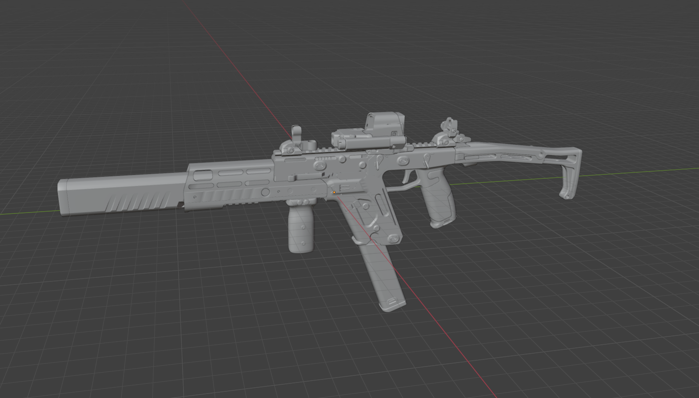

将其以`.fbx`格式导出，然后导入到再在`Substance 3D Painter`中新建项目，选择此模型。

模板推荐选`PBR - Specular Glossiness`，分辨率选择`2048`。
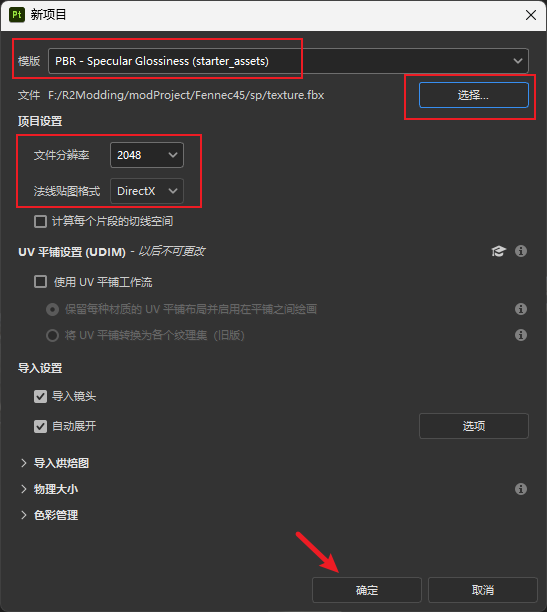

然后调整一下每个材质的通道，如图
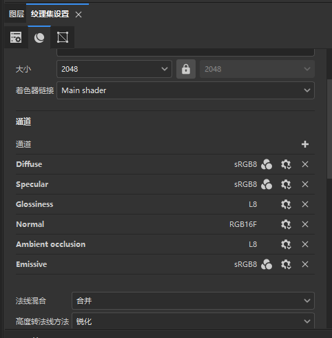

此时如果你已经准备好了各种材质的贴图，那么就可以导入并进行处理了

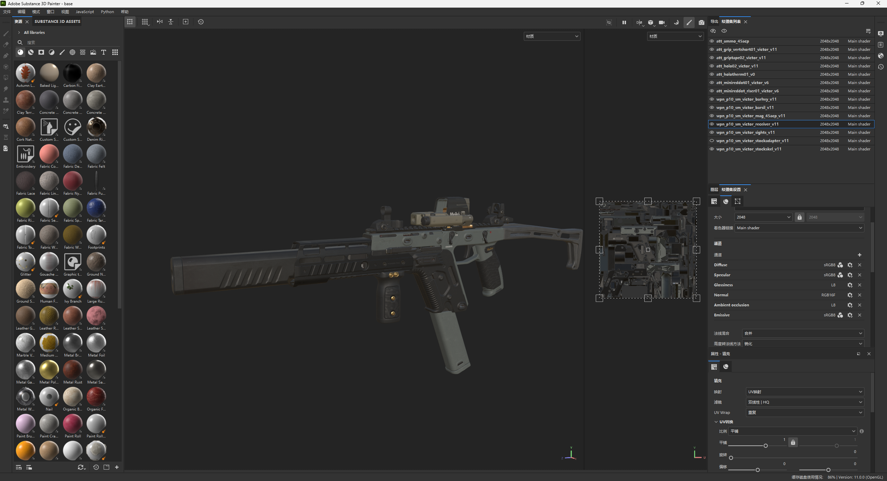

### 6.2.2 处理贴图

我们首先需要明确游戏需要哪些贴图，具体的文档和信息可以阅读这个文档[Texture Maps | RETRY](https://retryy.gitbook.io/tf2/wiki/references/texturemaps)。

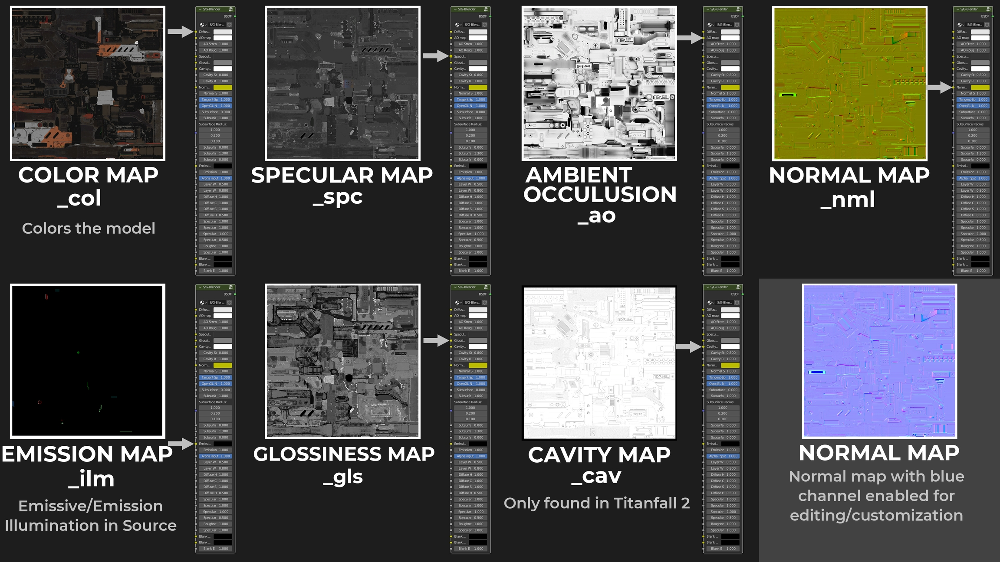

综合来说我们需要七张贴图，分别是

- col，漫反射/颜色贴图
- spc，金属度贴图
- ao，环境光遮蔽贴图
- nml，法线贴图
- ilm，发光贴图
- gls，光泽度贴图
- cav，很像高度贴图但并不是，游戏独有的，我们直接全白即可

RETRY这位作者帮我们整理了所有贴图的类型，以及每个贴图的用途。再次感激他！

无论你是使用`Blender`还是`Substance 3D Painter`，我们的目标都是得到上述的贴图。

#### 6.2.2.1 迷彩msk贴图

如果你还需要制作迷彩支持，那么你还需要制作另一种msk(mask)贴图，作为迷彩的遮罩，告诉游戏哪些地方是应用迷彩的。

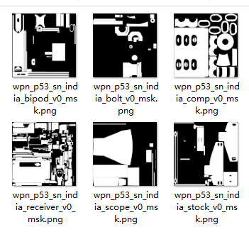

如上图，白色的部分表示允许覆盖迷彩，黑色的部分表示不允许覆盖迷彩，仍然使用col贴图的部分。在后续的材质制作需要用到。

#### 6.2.2.2 额外信息

重生娱乐在一篇文章中揭露了一些他们在制作《APEX传奇》的材质和武器贴图的细节，我们同样也可以参考一下。

[Creating 3D Textures for Apex Legends - Adobe Substance 3D](https://www.adobe.com/products/substance3d/magazine/apex-legends-texturing-battle-royale-phenomenon-2019.html)

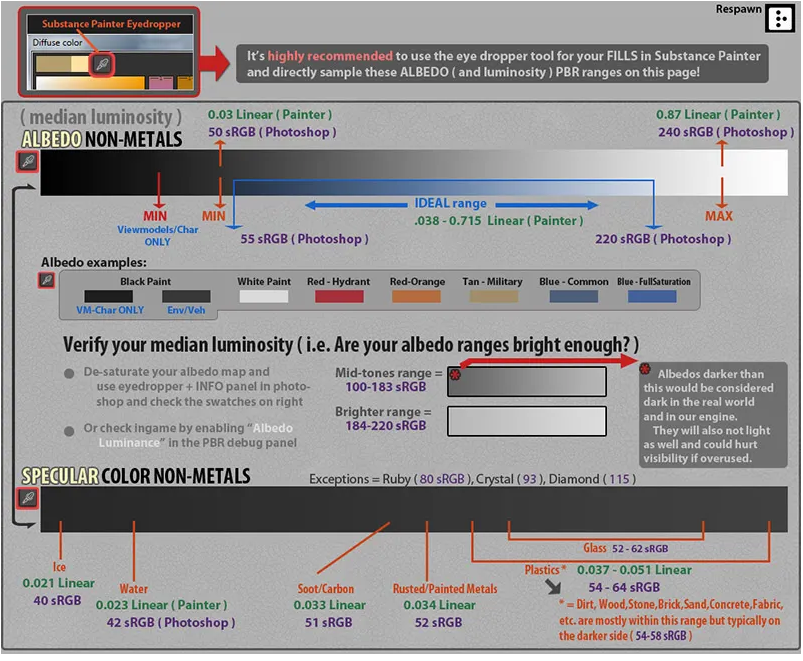
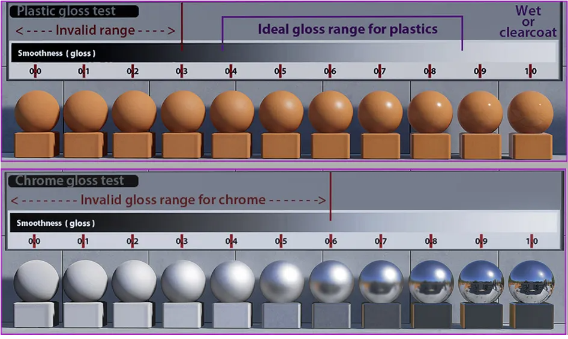

上面的两张图告诉了我们贴图颜色的合理范围是什么，如何根据需求反推贴图的明度等，具有十分重要的参考价值。

比如如果你的贴图明度很高，在游戏里就会触发hdr曝光非常亮，如果太暗又会导致整个贴图在游戏里发黑发紫。

### 6.2.3 将贴图导出

如果你是使用`Substance 3D Painter`，可以参考我的导出贴图预设：
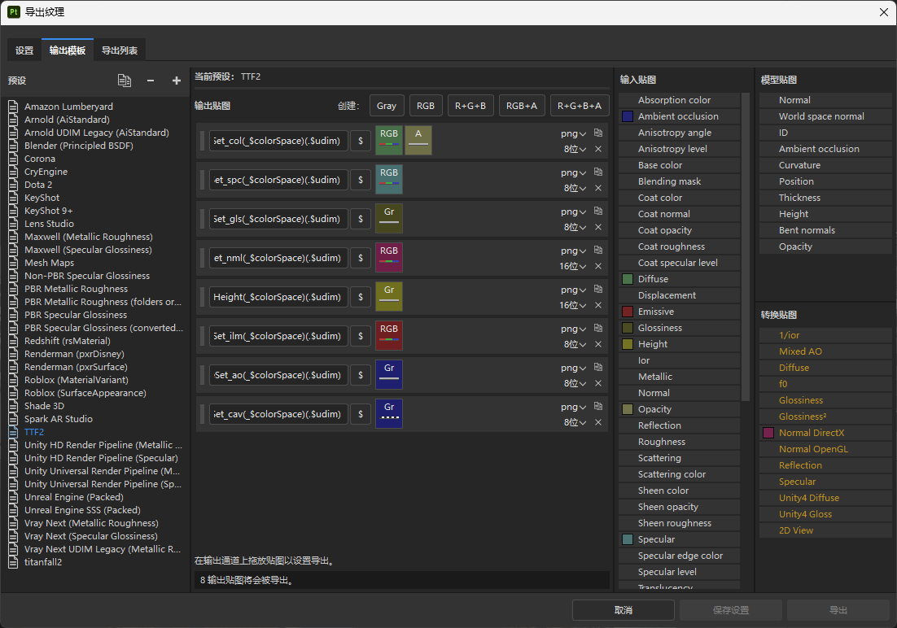

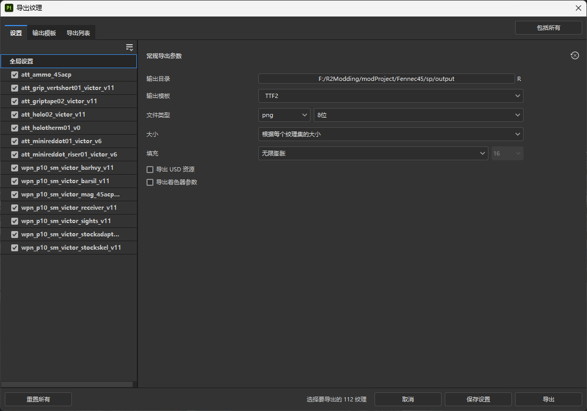

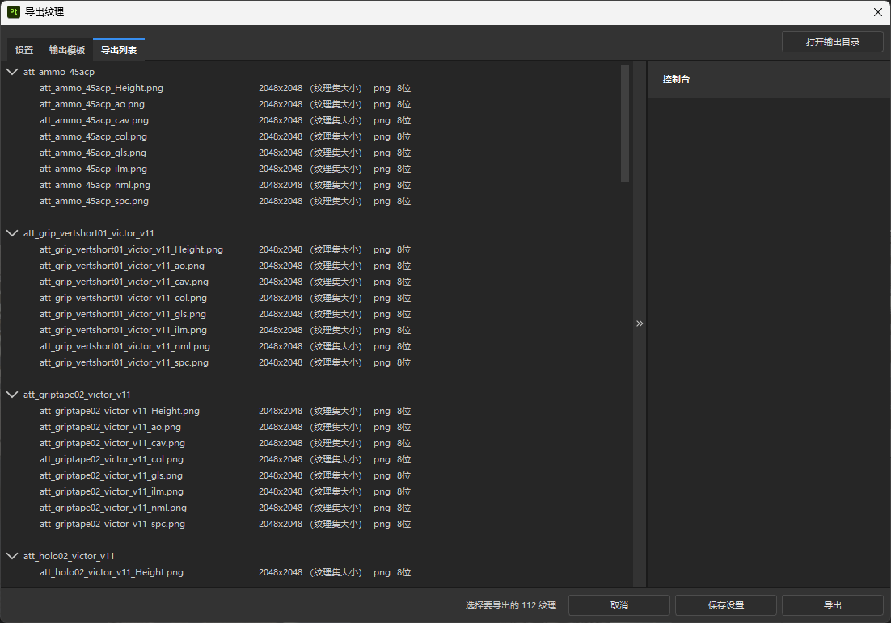

注意这样子导出的贴图每个材质会多一个`_Height`贴图，这个我们用不上，忽略即可。

