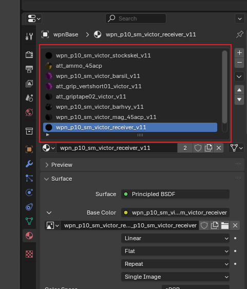
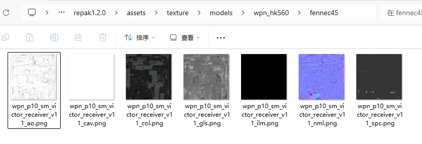
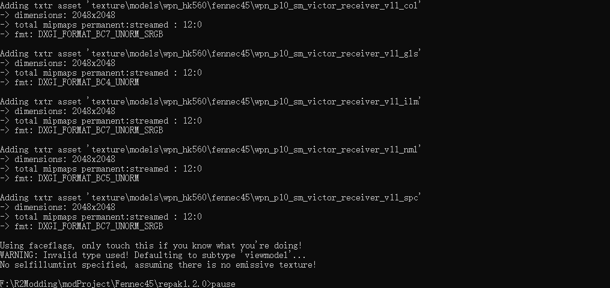
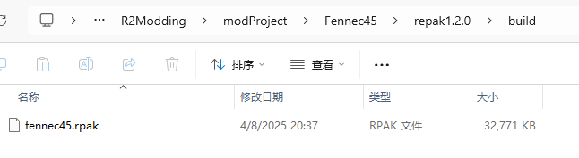
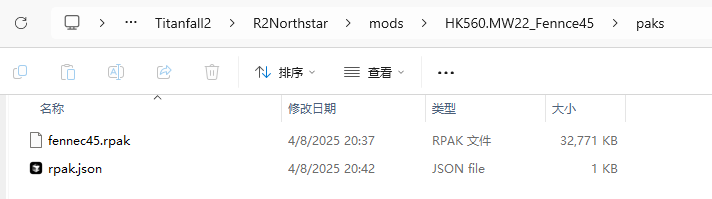

# 6. 处理材质

## 6.1 整体流程简述
基本上ttf2使用的还是旧版本的PBR渲染流。但由于目前对于游戏的修改有限，我们没法直接修改调整游戏的着色器。我们只能使用原本游戏提供的着色器，然后只替换贴图。不过由于游戏使用的贴图类型比较特别，之后会详细提及。

游戏原本的武器，可能一个mdl文件里就只使用了三四个材质，但我们制作武器mod时，可能需要使用到更多的材质。尤其是cod的武器，往往一下子就有十几个材质。材质太多会导致一些非常神秘的问题，例如偶发性的游戏崩溃，无法加载材质等问题。推荐是尽量降低材质数，材质过多推荐采用合并uv合并材质的方式。

一般来说我会选择先制作一个用于方便制作贴图的模型，这个模型删除掉所有的骨骼和不必要的网格，将其导出，然后导入到专业的贴图绘制软件如`Adobe Substance 3D Painter`中, 然后制作贴图。然后再将制作好的贴图导出，使用工具编写材质，转换成游戏可以识别的格式。

接下来我将会先简单演示我是如何处理贴图的，然后会讲解如何编写材质。


## 6.2 制作贴图

因为我是移植的MW2022的武器，已经拥有了武器原本的贴图，我只需要导入到`Substance 3D Painter`中，然后进行处理优化即可。

### 6.2.1 将模型导入到Substance 3D Painter中

:::warning
我不会在这里详细讲解如何使用`Substance 3D Painter`，因为这需要大量的篇幅，且每个人对于贴图的制作方式不同，也不一定使用相同的软件。如果需要详细了解如何使用`Substance 3D Painter`，可以自行搜索相关教程。
:::


我们可以新建一个blender项目，处理一下模型，将其修改为方便制作贴图的模型。如图


将其以`.fbx`格式导出，然后导入到再在`Substance 3D Painter`中新建项目，选择此模型。

模板推荐选`PBR - Specular Glossiness`，分辨率选择`2048`。


然后调整一下每个材质的通道，如图


此时如果你已经准备好了各种材质的贴图，那么就可以导入并进行处理了


### 6.2.2 处理贴图

我们首先需要明确游戏需要哪些贴图，具体的文档和信息可以阅读这个文档[Texture Maps | RETRY](https://retryy.gitbook.io/tf2/wiki/references/texturemaps)。


综合来说我们需要七张贴图，分别是

- col，漫反射/颜色贴图
- spc，金属度贴图
- ao，环境光遮蔽贴图
- nml，法线贴图
- ilm，发光贴图
- gls，光泽度贴图
- cav，很像高度贴图但并不是，游戏独有的，我们直接全白即可

RETRY这位作者帮我们整理了所有贴图的类型，以及每个贴图的用途。再次感激他！

无论你是使用`Blender`还是`Substance 3D Painter`，我们的目标都是得到上述的贴图。

#### 6.2.2.1 迷彩msk贴图

如果你还需要制作迷彩支持，那么你还需要制作另一种msk(mask)贴图，作为迷彩的遮罩，告诉游戏哪些地方是应用迷彩的。


如上图，白色的部分表示允许覆盖迷彩，黑色的部分表示不允许覆盖迷彩，仍然使用col贴图的部分。在后续的材质制作需要用到。

#### 6.2.2.2 额外信息

重生娱乐在一篇文章中揭露了一些他们在制作《APEX传奇》的材质和武器贴图的细节，我们同样也可以参考一下。

[Creating 3D Textures for Apex Legends - Adobe Substance 3D](https://www.adobe.com/products/substance3d/magazine/apex-legends-texturing-battle-royale-phenomenon-2019.html)


上面的两张图告诉了我们贴图颜色的合理范围是什么，如何根据需求反推贴图的明度等，具有十分重要的参考价值。

比如如果你的贴图明度很高，在游戏里就会触发hdr曝光非常亮，如果太暗又会导致整个贴图在游戏里发黑发紫。


### 6.2.3 将贴图导出


如果你是使用`Substance 3D Painter`，可以参考我的导出贴图预设：


注意这样子导出的贴图每个材质会多一个`_Height`贴图，这个我们用不上，忽略即可。


## 6.3 制作材质

### 6.3.1 修改网格模型的材质名

回到我们原本的blender工程文件上`combineSkn.blend`, 复制一份，然后改名为`textureHandler.blend`, 然后打开这个文件。

现在我们需要对网格模型的材质名进行修改，因为游戏会根据材质名和路径来加载材质。

选择物体之后，在右侧属性面板里找到材质，可以看到当前物体使用了哪些材质


我们需要修改这些材质名：

例如

`wpn_p10_sm_victor_receiver_v11` 我改为了`models\wpn_hk560\fennce45\receiver`

`wpn_p10_sm_victor_guard_v11` 我改为了`models\wpn_hk560\fennce45\guard`

你可以看到材质名是包含了路径的，材质名和路径是相互对应的。

此外并没有太多的格式要求，只要保证不同的材质名不会重复,也不会和游戏原本的材质冲突，你能分辨清楚即可。请注意不要直接将材质放到根路径下，比如'receiver'，'guard'，'comp'这种不合理的材质名。

将所有材质名修改完毕后，我们即可重新导出这些模型为smd文件，此时这些模型smd就会使用新的材质名了。

### 6.3.2 使用RePak制作材质

`RePak`是专门给泰坦陨落2制作材质的工具，根据提供的贴图和配置文件生成游戏可以读取识别的.rpak文件

可以去这里下载[RePak](https://github.com/r-ex/RePak)，我们需要的是v1.2.0版本

:::warning
注意，repak不同版本之间区别非常大，此教程使用的是repak **v1.2.0**版本，请不要下载错！！！
更新的版本因为还没有文档，且有许多破坏性改动，不兼容此教程的方法！
:::

下载完成后，新建一个文件夹`repak1.2.0`并将`RePak.exe`复制到该目录下。

在此目录下新建个`pack_all.bat`文件，内容如下：

```bat
for %%i in ("%~dp0maps\*") do "%~dp0RePak.exe" "%%i"
pause
```
再在此目录下新建这几个文件夹`maps` `build` `assets`

此时文件夹布局的如下
```
repak1.2.0
├── assets
├── build
├── maps
├── pack_all.bat
└── RePak.exe
```
这算是准备好了基础的环境，接下来我们来写生成打包材质所需要的配置文件。

在`maps`文件夹下面新建一个`fennce45.json`文件，文件名随意，json格式即可。

此文件相当于一个配置文件，告诉repak使用何种材质有何种参数，贴图文件在哪，repak再根据这些配置参数去生成.rpak文件。可以阅读repak的[官方文档](https://r2northstar.readthedocs.io/en/latest/repak/)，不过非常不完善。

我们先复制以下模板内容到此json文件中，并进行编辑

```json
{
	"assetsDir": "../assets",   //对应资产文件夹，我们已经创建好了
	"outputDir": "../build",    //对应输出文件夹，我们已经创建好了
	"name": "fennec45",         //对应生成出来的rpak文件名，我们使用的是fennec45
	"version": 7,               //对应泰坦陨落2的版本，我们使用的是7，不要修改
	"files": []                 //对应材质文件和贴图文件，我们接下来会添加
}
```

然后我们开始编辑这个json文件

首先我们先添加一个材质，以`models\wpn_hk560\fennce45\receiver`为例，在`files`数组中添加一个对象, 如下

```json 
{
	"assetsDir": "../assets",   //对应资产文件夹，我们已经创建好了
	"outputDir": "../build",    //对应输出文件夹，我们已经创建好了
	"name": "fennec45",         //对应生成出来的rpak文件名，我们使用的是fennec45
	"version": 7,               //对应泰坦陨落2的版本，我们使用的是7，不要修改
	"files": [
        {   // [!code focus:35]
			"$type": "matl",
			"version": 12,
			"type": "skn",
			"subtype": "",
			"surface": "default",
			"path": "models\\wpn_hk560\\fennce45\\receiver", //材质名
			"materialrefs": [
				"code_private/depth_shadow",
				"code_private/depth_prepass",
				"code_private/depth_vsm"
			],
			"shaderset": "uberAoCavEmitEntcolmeSamp2222222_fix",
			"textures": [ //贴图槽，对应贴图文件
				"",//col
				"",//nml
				"",//gls
				"",//spc
				"",//ilm
				"",
				"",
				"",
				"",
				"",
				"",
				"",//ao
				""//cav
			],
			"visibilityflags": "opaque",
			"faceflags": "6",
			"flags": "1D0300",
			"flags2": "56000020",
			"width": 2048, //贴图宽度
			"height": 2048 //贴图高度
		}
    ]            
}
```

已经添加了材质，我们接下来添加`models\wpn_hk560\fennce45\receiver`所需要的贴图，

我们计划将贴图文件放在路径`textures\models\wpn_hk560\fennce45\`下，对应的，我们需要按照此路径在`assets`文件夹下新建文件夹，并添加贴图文件。

然后在`assets\textures\models\wpn_hk560\fennce45\`下粘贴我们的贴图文件



但我们的贴图文件是png格式，**repak只接受dds格式的贴图**，因此我们在这里还需要使用一些工具转换图片格式。

--------


- col（颜色贴图）请使用 BC7_UNORM_SRGB 格式
- nml（法线贴图）请使用 BC5_UNORM 格式
- gls（高光/遮罩贴图）请使用 BC4_UNORM 格式
- spc（金属度贴图）请使用 BC7_UNORM 格式
- ao（环境光遮蔽贴图）请使用 BC4_UNORM 格式
- ilm（自发光贴图）请使用 BC7_UNORM 格式
- cav 请使用 BC4_UNORM 格式
- 其他不知道是什么的贴图请使用 BC7_UNORM_SRGB 格式

为此我编写了一个python脚本，并使用[texconv](https://github.com/microsoft/DirectXTex/wiki/texconv)这个工具进行批量贴图格式转换。你可以在这里下载这个脚本[texture_converter.py](https://github.com/HK560/TTF2ModdingRes/blob/main/tools/script/texture_converter.py)

此脚本通过读取贴图文件名，自动判断贴图类型，并使用texconv进行转换。这要求你的贴图文件名符合以下规则：

- 法线贴图：*nml.png
- 光泽度贴图：*gls.png
- 其他贴图：*.png
- 环境光遮蔽贴图：*ao.png
- 发光贴图：*ilm.png
- 金属度贴图：*spc.png

将此脚本复制到贴图目录下，使用python3运行此脚本，即可自动将贴图转换为dds格式。

使用方法如下
```bash
usage: texture_converter.py [-h] [--path PATH] [--skip-existing] [--backup] [--verbose] [texconv_path]

PNG to DDS Texture Converter Tool

positional arguments:
  texconv_path         Full path to texconv.exe (default: search in PATH environment variable)

options:
  -h, --help           show this help message and exit
  --path, -p PATH      Directory path to process (default: current directory)
  --skip-existing, -s  Skip existing DDS files (default: overwrite)
  --backup, -b         Backup existing DDS files before overwriting
  --verbose, -v        Show detailed output

DESCRIPTION:
This tool converts PNG texture files to DDS format using Microsoft's texconv utility.
It automatically selects the appropriate compression format based on the texture type:

• Normal maps (*nml.png) → BC5_UNORM (best for normal data)
• Glossiness/Mask maps (*gls.png, *msk.png) → BC4_UNORM (grayscale compression)
• Standard textures (*.png) → BC7_UNORM_SRGB (high quality color compression)

USAGE EXAMPLES:
  python texture_converter.py                    # Use texconv from PATH
  python texture_converter.py "C:/Program Files/texconv.exe"  # Use specific texconv path
  python texture_converter.py --path "D:/textures"
  python texture_converter.py --backup
  python texture_converter.py --skip-existing

REQUIREMENTS:
• Microsoft DirectX Texture Converter (texconv.exe)
• PNG files in the target directory
• Windows operating system

COMPRESSION FORMATS:
  BC5_UNORM:     8:1 compression, ideal for normal maps
  BC4_UNORM:     8:1 compression, grayscale data
  BC7_UNORM_SRGB: 3:1 compression, high quality color with sRGB


```

当然你也可以使用其他工具如`paint.net`进行转换就是了。

--------

然后我们继续，根据贴图文件路径补充json文件

```json
{
	"assetsDir": "../assets",   //对应资产文件夹，我们已经创建好了
	"outputDir": "../build",    //对应输出文件夹，我们已经创建好了
	"name": "fennec45",         //对应生成出来的rpak文件名，我们使用的是fennec45
	"version": 7,               //对应泰坦陨落2的版本，我们使用的是7，不要修改
	"files": [
        { // [!code focus:35]
			"$type": "txtr",
			"path": "texture\\models\\wpn_hk560\\fennec45\\wpn_p10_sm_victor_receiver_v11_ao",
			"disableStreaming": true
		},
		{
			"$type": "txtr",
			"path": "texture\\models\\wpn_hk560\\fennec45\\wpn_p10_sm_victor_receiver_v11_cav",
			"disableStreaming": true
		},
		{
			"$type": "txtr",
			"path": "texture\\models\\wpn_hk560\\fennec45\\wpn_p10_sm_victor_receiver_v11_col",
			"disableStreaming": true
		},
		{
			"$type": "txtr",
			"path": "texture\\models\\wpn_hk560\\fennec45\\wpn_p10_sm_victor_receiver_v11_gls",
			"disableStreaming": true
		},
		{
			"$type": "txtr",
			"path": "texture\\models\\wpn_hk560\\fennec45\\wpn_p10_sm_victor_receiver_v11_ilm",
			"disableStreaming": true
		},
		{
			"$type": "txtr",
			"path": "texture\\models\\wpn_hk560\\fennec45\\wpn_p10_sm_victor_receiver_v11_nml",
			"disableStreaming": true
		},
		{
			"$type": "txtr",
			"path": "texture\\models\\wpn_hk560\\fennec45\\wpn_p10_sm_victor_receiver_v11_spc",
			"disableStreaming": true
		}，
        {   
			"$type": "matl",
			"version": 12,
			"type": "skn",
			"subtype": "",
			"surface": "default",
			"path": "models\\wpn_hk560\\fennce45\\receiver", //材质名
			"materialrefs": [
				"code_private/depth_shadow",
				"code_private/depth_prepass",
				"code_private/depth_vsm"
			],
			"shaderset": "uberAoCavEmitEntcolmeSamp2222222_fix",
			"textures": [ //贴图槽，对应贴图文件
				"texture\\models\\wpn_hk560\\fennec45\\wpn_p10_sm_victor_receiver_v11_col",//col  [!code focus:13]
				"texture\\models\\wpn_hk560\\fennec45\\wpn_p10_sm_victor_receiver_v11_nml",//nml
				"texture\\models\\wpn_hk560\\fennec45\\wpn_p10_sm_victor_receiver_v11_gls",//gls
				"texture\\models\\wpn_hk560\\fennec45\\wpn_p10_sm_victor_receiver_v11_spc",//spc
				"texture\\models\\wpn_hk560\\fennec45\\wpn_p10_sm_victor_receiver_v11_ilm",//ilm
				"",
				"",
				"",
				"",
				"",
				"",
				"texture\\models\\wpn_hk560\\fennec45\\wpn_p10_sm_victor_receiver_v11_ao",//ao
				"texture\\models\\wpn_hk560\\fennec45\\wpn_p10_sm_victor_receiver_v11_cav"//cav
			],
			"visibilityflags": "opaque",
			"faceflags": "6",
			"flags": "1D0300",
			"flags2": "56000020",
			"width": 2048, //贴图宽度
			"height": 2048 //贴图高度
		}
    ]            
}
```
这样就好了，记得贴图资源声明要在材质之前。

对于其他材质我们也是类似这样的操作，这里不再赘述。

::: tip
因为repak有个神秘bug, 会偶尔出现材质找不到贴图导致游戏卡在加载无法启动。但是我们可以通过添加空材质来缓解这个问题。

例如我往往会在json最后面添加三个空材质类似如下：
::: details 空材质代码
```json
        {   
			"$type": "matl",
			"version": 12,
			"type": "skn",
			"subtype": "",
			"surface": "default",
			"path": "models\\wpn_hk560\\fennce45\\temp1", //空材质，不会被使用
			"materialrefs": [
				"code_private/depth_shadow",
				"code_private/depth_prepass",
				"code_private/depth_vsm"
			],
			"shaderset": "uberAoCavEmitEntcolmeSamp2222222_fix",
			"textures": [ //贴图槽，对应贴图文件
				"",//col 
				"",//nml
				"",//gls
				"",//spc
				"",//ilm
				"",
				"",
				"",
				"",
				"",
				"",
				"",//ao
				"",//cav
			],
			"visibilityflags": "opaque",
			"faceflags": "6",
			"flags": "1D0300",
			"flags2": "56000020",
			"width": 2048, //贴图宽度
			"height": 2048 //贴图高度
		},
        {   
			"$type": "matl",
			"version": 12,
			"type": "skn",
			"subtype": "",
			"surface": "default",
			"path": "models\\wpn_hk560\\fennce45\\temp2", //空材质，不会被使用
			"materialrefs": [
				"code_private/depth_shadow",
				"code_private/depth_prepass",
				"code_private/depth_vsm"
			],
			"shaderset": "uberAoCavEmitEntcolmeSamp2222222_fix",
			"textures": [ //贴图槽，对应贴图文件
				"",//col 
				"",//nml
				"",//gls
				"",//spc
				"",//ilm
				"",
				"",
				"",
				"",
				"",
				"",
				"",//ao
				"",//cav
			],
			"visibilityflags": "opaque",
			"faceflags": "6",
			"flags": "1D0300",
			"flags2": "56000020",
			"width": 2048, //贴图宽度
			"height": 2048 //贴图高度
		},
                {   
			"$type": "matl",
			"version": 12,
			"type": "skn",
			"subtype": "",
			"surface": "default",
			"path": "models\\wpn_hk560\\fennce45\\temp3", //空材质，不会被使用
			"materialrefs": [
				"code_private/depth_shadow",
				"code_private/depth_prepass",
				"code_private/depth_vsm"
			],
			"shaderset": "uberAoCavEmitEntcolmeSamp2222222_fix",
			"textures": [ //贴图槽，对应贴图文件
				"",//col 
				"",//nml
				"",//gls
				"",//spc
				"",//ilm
				"",
				"",
				"",
				"",
				"",
				"", 
				"",//ao
				"",//cav
			],
			"visibilityflags": "opaque",
			"faceflags": "6",
			"flags": "1D0300",
			"flags2": "56000020",
			"width": 2048, //贴图宽度
			"height": 2048 //贴图高度
		}
```
:::

保存，然后我们运行`pack_all.bat`打包了。



观察控制台打印，确保没有错误，然后我们就可以在`build`文件夹下找到我们打包好的rpak文件了。



我们将此rpak文件复制到上一章节中我们为了测试武器模型动画而创建的北极星mod包中，放到`HK560.MW22_Fennce45\paks`文件夹下，并在此文件夹下新建一个`rpak.json`文件，内容如下：
```json
{
	"Aliases": {},
	"Preload": {},
	"Postload": {
		"fennec45.rpak": "common.rpak"
	}
}
```
其中`fennec45.rpak`是我们的武器模型rpak文件，`common.rpak`是北极星mod包的rpak文件，前者根据你实际生成出来的rpak文件名填写，后者不需要改变。此文件的作用是告知游戏：在加载北极星mod包时，先加载`common.rpak`，然后再加载`fennec45.rpak`。

那么现在文件夹的布局如下：



我们就可以启动游戏查看效果了！


